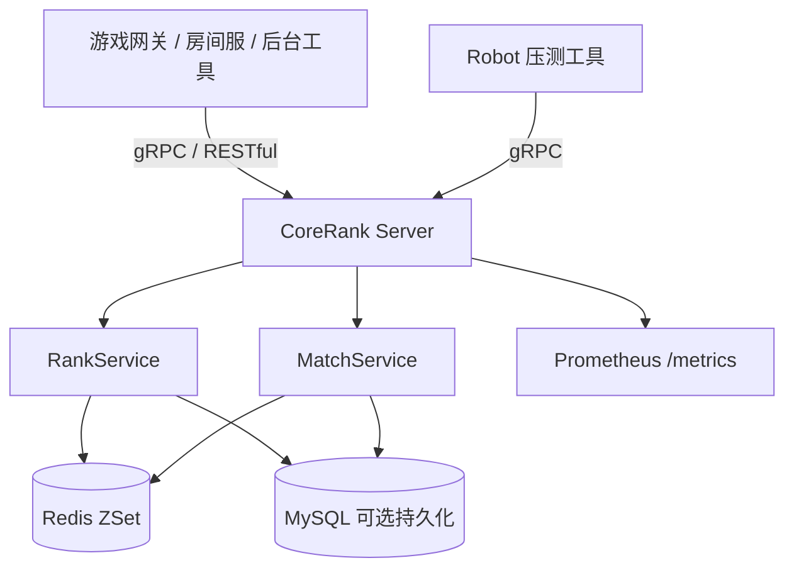

# CoreRank 项目方案书

## 项目定位

CoreRank 是一个面向竞技游戏服务端场景的 Go 匹配与排行榜中台项目。它负责处理排行榜写入、TopN 查询、匹配票据生命周期、匹配结果查询，以及可选的 MySQL 持久化。

它不是完整游戏服务器，也不包含客户端、账号系统、真实房间服、真实战斗服或生产级高可用部署。

当前简历定位建议：

```text
CoreRank 游戏匹配与排行榜中台（Go）
基于 Go 实现面向竞技游戏服务端的匹配与排行榜服务，提供 gRPC / RESTful 双协议接入；使用 Redis ZSet 与 Lua 脚本承载匹配池、排行榜和候选玩家原子摘取，设计 MatchTicket / MatchResult 状态流转支持入队、取消、超时和匹配结果查询；使用 MySQL 可选持久化玩家、匹配票据和匹配结果，并接入 Prometheus 指标、CI 和 Robot 压测脚本完成可复现验证。
```

## 当前已实现能力

| 模块 | 当前状态 | 说明 |
|---|---|---|
| 排行榜 | 已实现 | 支持更新玩家分数、查询 TopN、查询个人排名 |
| 匹配池 | 已实现 | 使用 Redis ZSet 保存匹配候选玩家 |
| 原子摘取 | 已实现 | 使用 Redis Lua 将候选查询和删除合并为一次原子操作 |
| 匹配票据 | 已实现 | 支持创建、查询、取消、超时和匹配成功状态 |
| 匹配结果 | 已实现 | 支持生成 `match_id`、逻辑 `room_id` 并查询结果 |
| gRPC | 已实现 | 暴露排行榜和匹配生命周期接口 |
| RESTful | 已实现 | 提供调试、联调和演示接口 |
| MySQL | 已实现基础版 | 可选持久化玩家分数、匹配票据、匹配结果和榜单快照 |
| MySQL 降级 | 已实现基础版 | 默认 MySQL 写入失败不阻断 Redis 主链路 |
| Prometheus | 已实现基础版 | 暴露 gRPC、匹配成功、取消、超时、queued 数量等指标 |
| Robot 压测 | 已实现 | 支持配置并发数、请求数和目标 gRPC 地址 |
| CI | 已实现 | GitHub Actions 执行测试、vet 和构建 |

## 当前未实现边界

以下内容不是当前已完成功能，未验证前不应写进简历正文：

- 真实房间服或战斗服资源分配。
- 匹配结果主动通知玩家、网关或房间服。
- JWT、账号鉴权和权限模型。
- Redis Cluster 实测部署。
- 多实例高可用部署。
- Linux 云服务器完整部署验证。
- Grafana 仪表盘配置和演示。
- 生产级 P95/P99 指标采集。
- 生产环境性能承诺。

## 技术路线

### 阶段 0：可信展示基线

目标是让公开仓库和真实能力一致。

已完成：

- README 降风险。
- GitHub Actions CI。
- 验证文档。
- 本地和远程测试记录。
- Node.js 20 actions warning 处理。

### 阶段 1：匹配生命周期闭环

目标是把“玩家入池和摘取”升级为完整匹配服务。

已完成：

- `MatchTicket` 创建、查询、取消和超时。
- `MatchResult` 查询。
- 匹配成功生成 `match_id` 和逻辑 `room_id`。
- `RoomAllocator` 抽象。

仍待补充：

- 真实房间服 / 战斗服资源分配。
- 匹配结果主动通知。

### 阶段 2：MySQL 持久化证据链

目标是让 Redis 热数据和 MySQL 持久化职责清楚。

已完成：

- `players`、`match_tickets`、`match_results`、`rank_snapshots` 表结构。
- 玩家分数落库。
- 匹配票据和匹配结果落库。
- 榜单快照写入。
- MySQL 写入失败时默认降级到 Redis 主链路。
- MySQL repository 集成测试。

仍待补充：

- Docker Compose 中完整纳入 MySQL 本地验证链路。
- 更完整的索引说明。
- 强依赖模式自动化回归测试。

### 阶段 3：可观测性、压测与公开文档

目标是让项目可复现、可解释、可展示。

已完成：

- Prometheus `/metrics`。
- gRPC 请求计数和延迟指标。
- 匹配成功、取消、超时、queued 数量和生命周期耗时指标。
- REST demo 自动检查 metrics。
- 本机 Robot 压测记录。
- 本地测试与面试演示指南。

仍待补充：

- API 文档。
- 架构文档。
- Grafana dashboard。
- Linux 云服务器部署验证。
- P95/P99 真实采集。

## 架构概览



## 核心设计

### Redis Lua 原子摘取

匹配候选摘取如果拆成“查询候选玩家”和“删除候选玩家”两步，在并发场景下可能出现重复匹配。CoreRank 使用 Redis Lua 脚本把这两步收敛成一次原子执行。

### MatchTicket 状态流转

当前状态包括：

```text
queued -> matched
queued -> cancelled
queued -> timeout
```

匹配成功后会生成：

- `ticket_id`
- `match_id`
- 逻辑 `room_id`
- `MatchResult`

### Redis 与 MySQL 分工

| 存储 | 职责 |
|---|---|
| Redis | 排行榜热数据、匹配池、短期票据状态、短期匹配结果 |
| MySQL | 玩家分数、匹配票据、匹配结果、榜单快照 |

默认情况下 MySQL 是可选持久化层。Redis 主链路仍是当前请求成功与否的关键路径。

## 测试与验证

当前可复现验证方式：

```powershell
go test ./...
go vet ./...
python scripts\rest_demo.py
```

Robot 压测：

```powershell
go run ./cmd/server
go run ./cmd/robot
```

本机压测记录见 `docs/benchmark.md`。当前压测数字只代表 Windows 本机、当前 Redis 和当前 Robot 参数，不代表生产性能。

## 交付物

| 文件或目录 | 说明 |
|---|---|
| `README.md` | 项目定位、快速开始、已实现和未实现边界 |
| `docs/verification.md` | 验证指南 |
| `docs/api.md` | RESTful 和 gRPC API 文档 |
| `docs/architecture.md` | 架构说明 |
| `docs/benchmark.md` | 本机压测记录 |
| `docs/demo-guide.md` | 本地测试与面试演示指南 |
| `docs/interview-notes.md` | 面试讲法 |
| `docker-compose.yml` | Redis、Prometheus、Grafana 本地配置 |
| `prometheus.yml` | Prometheus 抓取配置 |

## 当前结论

CoreRank 当前已经具备可公开展示的主体能力。它可以作为 Go 游戏服务端方向的简历项目，但简历和面试中必须明确边界：当前完成的是匹配与排行榜中台的本机可验证版本，不是完整游戏服务器，也不是生产级部署系统。
