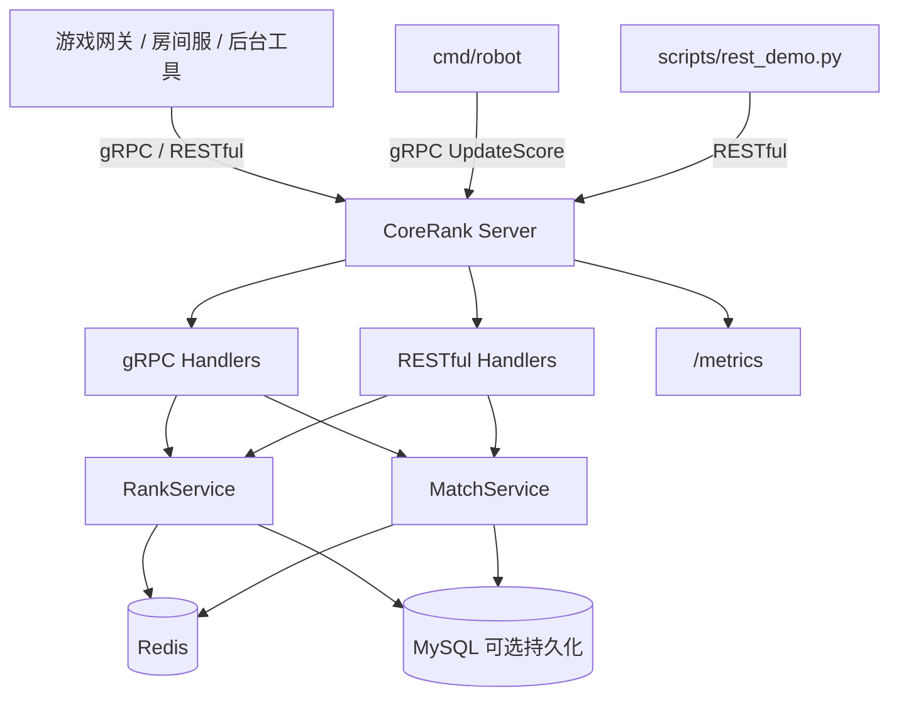

# CoreRank 技术报告

## 报告范围

本文档记录 CoreRank 当前已经实现并可验证的技术能力。它用于帮助阅读者快速理解项目架构、关键设计、验证结果和未完成边界。

本文档不宣称生产落地，不宣称 Redis Cluster、高可用、多实例部署、真实房间服调度或固定 P95/P99。

## 系统定位

CoreRank 是一个 Go 游戏匹配与排行榜中台。它面向游戏网关、房间服、后台工具或测试脚本提供 gRPC / RESTful 接入，内部使用 Redis 处理热数据，使用 MySQL 作为可选持久化层，并通过 Prometheus 暴露运行指标。

## 架构图



## 分层说明

| 层级 | 目录 | 职责 |
|---|---|---|
| 入口层 | `cmd/server` | 启动 Redis、gRPC、RESTful、metrics 和匹配 Worker |
| 协议层 | `api/proto` | 定义 gRPC 消息和服务 |
| Handler 层 | `internal/handler` | 处理 RESTful 和 gRPC 请求 |
| Service 层 | `internal/service` | 排行榜、匹配票据、超时扫描、房间分配抽象 |
| Repository 层 | `internal/repository` | Redis、Lua 脚本和 MySQL 读写 |
| 指标层 | `internal/metrics` | Prometheus 指标定义和记录 |
| 工具层 | `cmd/robot`、`scripts` | 压测和演示 |

## 核心技术点

### 1. Redis Lua 原子匹配

匹配系统的关键风险是重复摘取同一个玩家。CoreRank 使用 Redis Lua 脚本把候选查询和候选删除放进同一次 Redis 原子执行中，减少并发重复匹配风险。

核心价值：

- 避免 `ZRANGEBYSCORE` 和 `ZREM` 分离导致的竞态。
- 减少多次网络往返。
- 让匹配池状态变化集中在 Redis 内完成。

### 2. MatchTicket / MatchResult 生命周期

CoreRank 已经从简单匹配池升级为票据生命周期模型：

```text
CreateMatchTicket
  -> queued
  -> matched / cancelled / timeout
  -> GetMatchTicket / GetMatchResult
```

已实现状态：

- `queued`
- `matched`
- `cancelled`
- `timeout`

当前 `room_id` 是逻辑房间 ID，由 `RoomAllocator` 默认实现生成。它保留了替换真实房间服分配的扩展点，但不代表真实战斗服调度已经完成。

### 3. Redis 与 MySQL 分工

Redis 负责：

- 排行榜热数据。
- 匹配池。
- 短期匹配票据。
- 短期匹配结果。
- 票据超时扫描索引。

MySQL 负责：

- 玩家分数持久化。
- 匹配票据持久化。
- 匹配结果持久化。
- 榜单快照。

MySQL 默认是可选持久化层。连接失败或写入失败时，服务会记录 warning 并继续返回 Redis 主链路结果。需要强依赖时可使用 `CORERANK_MYSQL_REQUIRED=true`。

### 4. Prometheus 指标

当前已经暴露：

- gRPC 请求计数。
- gRPC 请求延迟直方图。
- 匹配成功计数。
- 匹配取消计数。
- 匹配超时计数。
- 匹配票据事件计数。
- 匹配票据终态耗时直方图。
- queued 票据数量。

指标可以通过 `http://localhost:9091/metrics` 查看。Grafana 仪表盘配置仍属于后续工作。

## 本机压测记录

当前可引用的压测记录来自 `docs/benchmark.md`：

| 指标 | 结果 |
|---|---|
| 测试环境 | Windows 本机 |
| Redis | 本机 `127.0.0.1:6379` |
| 请求类型 | gRPC `UpdateScore` |
| 总请求数 | 10000 |
| 成功请求数 | 10000 |
| 失败请求数 | 0 |
| 成功率 | 100.00% |
| TPS | 29916.63 req/sec |
| 平均延迟 | 3.22 ms |

边界说明：

- 这是本机开发环境结果。
- 本轮 Robot 压测未启用 MySQL。
- 当前记录平均延迟，不记录 P95/P99。
- 该数据不能写成线上吞吐或线上延迟承诺。

## 验证证据

当前已经执行过的验证包括：

- `go test ./...`
- `go test ./...`，带本机 MySQL 测试 DSN
- `go test -count=3 ./...`，带 Redis/MySQL
- `go vet ./...`
- `go build ./cmd/server`
- `go build ./cmd/robot`
- `python scripts\rest_demo.py`
- Robot 本机压测
- GitHub Actions CI

详见：

- `docs/verification.md`
- `docs/benchmark.md`
- `docs/demo-guide.md`

## 未完成技术项

| 项目 | 当前状态 |
|---|---|
| 真实房间服 / 战斗服调度 | 未实现 |
| 匹配结果主动通知 | 未实现 |
| JWT / 账号鉴权 | 未实现 |
| Redis Cluster 实测 | 未实现 |
| Grafana dashboard | 未实现 |
| Linux 云服务器部署验证 | 未实现 |
| P95/P99 采集 | 未实现 |
| 多实例高可用 | 未实现 |

## 面试表达边界

可以说：

- 使用 Go 实现了匹配与排行榜中台。
- 使用 Redis ZSet 和 Lua 脚本降低重复匹配风险。
- 设计了 `MatchTicket` / `MatchResult` 状态流转。
- 接入了 MySQL 可选持久化和故障降级。
- 接入了 Prometheus 指标。
- 有 CI、REST demo、Robot 压测和验证文档。

不要说：

- 已经生产落地。
- 已经支持完整房间服或战斗服调度。
- 已经验证 Redis Cluster。
- 已经完成 Grafana 仪表盘配置。
- 已经采集 P99。
- 已经具备生产级高可用。

## 结论

CoreRank 当前已经从“排行榜 + 匹配池 demo”推进到“可验证的匹配与排行榜中台”。它适合作为 Go 游戏服务端方向简历项目，但公开材料需要始终保持边界清楚：已完成的是本机可验证的中台核心能力，后续仍需要补真实房间服调度、Grafana 演示、Linux 部署和分位数性能采集。
