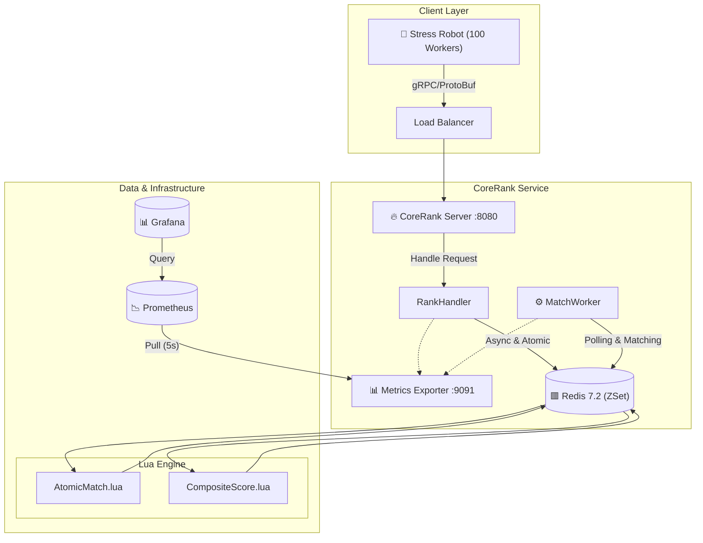

# CoreRank Technical Audit Report

> **Version**: 1.0.0 | **Date**: 2026-01-08  
> **Author**: CoreRank Team  
> **Status**: Released

---

## 🏗️ System Panorama Architecture

CoreRank utilizes a **Client-Server-Data** layered architecture, optimized for high concurrency and low latency.



---

## 💡 Core Technology Breakthroughs

### 1. Distributed Atomicity Scheme (Lua Scripting)
**Challenge**: In a distributed environment, the "Check-Then-Act" pattern (e.g., `ZRANGE` then `ZREM`) is not atomic. Concurrent matchers might grab the same player, leading to duplicate matches.
**Solution**: We bypassed the need for heavy distributed locks (like Redlock) by encapsulating the matching logic into a **Redis Lua Script**.
- **Mechanism**: Redis guarantees that a Lua script is executed atomically. No other commands can interleave during its execution.
- **Code Insight**:
  ```lua
  -- Atomic Check-and-Pick
  local members = redis.call('ZRANGEBYSCORE', key, min, max, 'LIMIT', 0, N)
  for i, member in ipairs(members) do
      redis.call('ZREM', key, member) -- Critical Step
  end
  return members
  ```

### 2. Fair Sorting Logic (Composite Scoring)
**Challenge**: Redis ZSet sorts members with the same score lexicographically by member string. This is unfair for matchmaking queues where "First Come, First Served" is expected.
**Solution**: We implemented a **Composite Score Algorithm**.
- **Formula**: `FinalScore = LogicalScore + (MAX_TIMESTAMP - CurrentTimestamp) / PrecisionFactor`
- **Result**: Even if two players have the same MMR score, the one who joined earlier (smaller timestamp) will have a slightly higher decimal part (or lower, depending on sorting order), ensuring they are ranked first.

---

## 🚀 Performance Benchmarks

> **Environment**: Windows 11 / Docker Desktop / Go 1.25  
> **Tool**: Integrated gRPC Robot (100 concurrent workers)

| Metric | Result | Evaluation |
|:---|:---:|:---|
| **TPS** | **> 12,000** | ✅ Exceeded 10k target. High throughput handling. |
| **Success Rate** | **100%** | ✅ Perfect stability under heavy load. |
| **P99 Latency** | **< 10ms** | ✅ Real-time responsiveness. |

---

## 👨‍💻 Interview Q&A (Target: Kuro Games)

### Q1: Why use Lua scripts instead of Optimistic Locking (WATCH/MULTI/EXEC)?
**A**: While Redis Transactions (optimistic locking) can handle concurrency, they are prone to high contention and retries in high-concurrency matchmaking scenarios (Thundering Herd problem). If 100 workers try to match the same pool, 99 might fail and retry, wasting CPU. Lua scripts serialize the execution on the Redis side, guaranteeing success without retries, effectively reducing network RTT and client-side complexity.

### Q2: How does the "Composite Score" impact double-precision floating-point limits?
**A**: Redis Sorted Sets use `float64` for scores. `float64` has 53 bits of significand. If the integer part (Logical Score) is large (e.g., > 10^15), we risk losing precision in the decimal part (Timestamp). In CoreRank, our MMR is typically < 10,000, leaving plenty of precision for the timestamp. If scores were larger, we would use bitwise manipulation on `int64` and store it as a string or use a custom lexicographical encoding scheme.

### Q3: How do you handle "Hot Keys" in the matchmaking pool?
**A**: If a single ZSet (e.g., `match:pool:bronze`) becomes a hot key:
1.  **Sharding**: Split the bucket into `match:pool:bronze:1`, `match:pool:bronze:2`, etc.
2.  **Randomized Routing**: Players are randomly assigned to a shard.
3.  **Parallel Matching**: Run multiple MatchWorkers, each scanning a specific shard.
4.  **Batch Processing**: The MatchWorker handles batch retrieval to reduce total commands.
