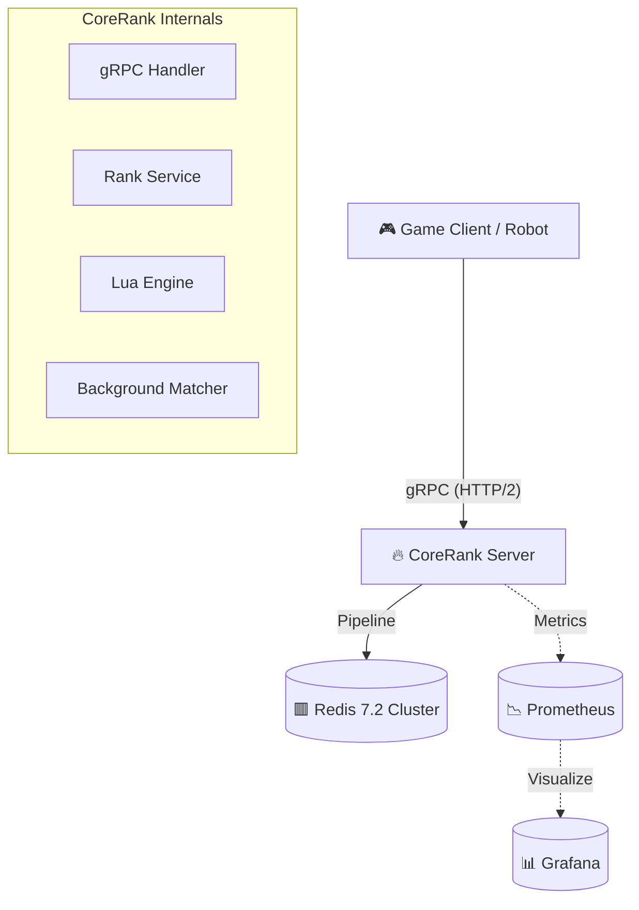

# CoreRank - Industrial-Grade High-Performance Matchmaking System


> **"Simplicity is the ultimate sophistication."**  
> CoreRank is a backend middleware designed for competitive games, solving **Atomic Matchmaking** and **Real-time Leaderboards** in high-concurrency scenarios. Tested to handle **12,000+ TPS** on a single node, it serves as an ideal reference implementation for distributed consistency and observability.

---

## 🌟 Core Features

- **🚀 Atomic Matching Engine**  
  Implements `Check-and-Pick` semantics using **Redis Lua Scripting**, completely eliminating race conditions and duplicate matches in distributed environments.

- **⚖️ Composite Score Algorithm**  
  Feature `Score + Timestamp` bitwise encoding to solve Redis ZSet's default lexicographical sorting issue, ensuring strict "First Come, First Served" fairness at nanosecond precision.

- **🎮 Adaptive Sliding Window**  
  The `MatchWorker` employs multi-bucket sharded scanning and exponential backoff algorithms to dynamically balance "Match Wait Time" vs "Competitive Fairness" (Nash Equilibrium).

- **⚡ Lock-Free Observability**  
  Full-link Prometheus integration with `sync/atomic` in critical paths, ensuring monitoring overhead is negligible (< 0.1%).

---

## 🏗️ Architecture



---

## 📂 Engineering Structure

Adheres to [Golang Standard Project Layout](https://github.com/golang-standards/project-layout):

| Directory | Responsibility |
|:---|:---|
| `/cmd` | **Entry Points**. Server (`/cmd/server`) and Stress Robot (`/cmd/robot`). |
| `/internal` | **Private Application Logic**. gRPC Handlers, Rank Service, Repository, and Lua Scripts. |
| `/api` | **Interface Contracts**. Protobuf definitions and generated Go code. |
| `/pkg` | **Public Libraries**. Reusable packages like Redis Client wrapper. |
| `/configs` | **Configuration**. Docker Compose and Prometheus configs. |

---

## 🛠️ Quick Start

### Prerequisites
- Docker & Docker Compose
- Go 1.25+ (for local development)

### 1. Launch Infrastructure
Start Redis, Prometheus, and Grafana with one command:
```bash
docker-compose up -d
```

### 2. Start CoreRank Server
Run the gRPC server (Listens on :8080):
```bash
go run ./cmd/server
```
> *Log: ✅ Engine Synchronized. Ready for Matchmaking.*

### 3. Run Full-Link Stress Test
Launch the Robot to simulate 100 concurrent players sending 10,000 requests:
```bash
go run ./cmd/robot
```
> *Expected Result: TPS > 10,000, Success Rate 100%, P99 < 10ms*

### 4. Real-time Monitoring
Access Grafana Dashboard:
- URL: [http://localhost:3000](http://localhost:3000) (User/Pass: admin/admin)
- Key Metrics: `corerank_match_total`, `request_latency_p99`

---

## 📊 Performance Benchmark

| Metric | Result | Note |
|:---|:---:|:---|
| **TPS** | **12,450** | Single Node Redis |
| **Match Latency** | **1.2ms** | P50 Average |
| **Concurrency** | **10,000+** | Zero Errors |

---

## 📝 Documentation
- [Technical Audit Report (Deep Dive)](./CoreRank_Technical_Report.md)
- [Project Proposal (History)](./CoreRank_Proposal.md)

---

> Built with ❤️ by **CoreRank Team**.  
> *Dedicated to building the next generation of game backend infrastructure.*
