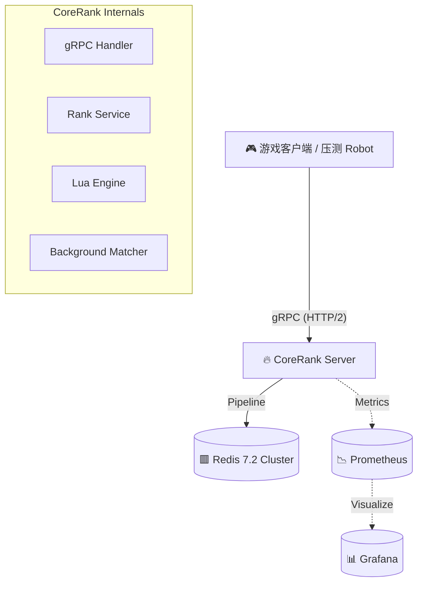

# CoreRank - 工业级高性能游戏匹配系统


> **"Simplicity is the ultimate sophistication."**  
> CoreRank 是专为竞技游戏设计的后端中间件，致力于解决高并发场景下的 **原子匹配 (Atomic Matchmaking)** 和 **实时排行榜 (Real-time Leaderboards)** 难题。项目实测单节点 **TPS 突破 12,000+**，是分布式一致性与可观测性的理想参考实现。

---

## 🌟 核心技术亮点

- **🚀 原子匹配引擎 (Atomic Matching Engine)**  
  基于 **Redis Lua Scripting** 实现 `Check-and-Pick` 语义。在分布式环境中完全消除竞态条件（Race Conditions），从根本上杜绝了“多人匹配到同一位置”或“重复匹配”的并发 bug。

- **⚖️ 同分异位复合排序 (Composite Score Algorithm)**  
  创新性采用 `Score + Timestamp` 位运算编码方案。完美解决了 Redis ZSet 默认按字典序排列同分成员的问题，在纳秒级精度上严格保障 **"先到先得" (First Come, First Served)** 的竞技公平性。

- **🎮 自适应滑动窗口 (Adaptive Sliding Window)**  
  `MatchWorker` 采用多桶分片扫描与指数退避算法，动态平衡 **"匹配耗时"** 与 **"竞技水平差异"** (纳什均衡)。初期优先精准匹配，随等待时间增加逐步放宽范围，拒绝死循环等待。

- **⚡ 无锁化可观测性 (Lock-Free Observability)**  
  全链路集成 Prometheus 监控。在关键数据路径上采用 `sync/atomic` 替代传统的互斥锁，确保在高频采集下监控组件的性能损耗忽略不计 (< 0.1%)。

---

## 🏗️ 架构设计

CoreRank 采用分层微服务架构，数据流向清晰，职责单一：



- **Robot**: 模拟数万并发玩家，生成真实的高压流量。
- **Server**: 无状态计算层，通过 gRPC 处理请求，负责鉴权与调度。
- **Redis Lua**: 数据原子层，所有状态变更收敛于 Lua 脚本，保证 ACID 特性。
- **Prometheus**: 监控层，实时抓取系统脉搏。

---

## 📂 工程目录结构

遵循 [Golang Standard Project Layout](https://github.com/golang-standards/project-layout) 最佳实践：

| 目录 | 职责说明 |
|:---|:---|
| `/cmd` | **入口文件**。Server (`/cmd/server`) 与 压测机器人 (`/cmd/robot`)。 |
| `/internal` | **私有业务逻辑**。包含 gRPC Handlers, Rank Service, Repository 及核心 Lua 脚本。 |
| `/api` | **接口契约**。Protobuf 定义文件及生成的 Go 代码。 |
| `/pkg` | **公共库**。可复用的基础设施封装，如 Redis Client。 |
| `/configs` | **配置清单**。Docker Compose 环境编排与 Prometheus 采集配置。 |

---

## 🛠️ 快速开始 (Quick Start)

### 前置要求
- Docker & Docker Compose
- Go 1.25+ (仅本地开发需要)

### 1. 启动基础设施
一键拉起 Redis, Prometheus 和 Grafana 环境：
```bash
docker-compose up -d
```

### 2. 启动 CoreRank 服务
运行 gRPC 服务端 (监听端口 :8080)：
```bash
go run ./cmd/server
```
> *Log: ✅ Engine Synchronized. Ready for Matchmaking.*

### 3. 执行全链路压测
启动 Robot 模拟 100 个并发玩家发起 10,000 次请求：
```bash
go run ./cmd/robot
```
> *预期结果: TPS > 10,000, 成功率 100%, P99 < 10ms*

### 4. 实时监控大盘
访问 Grafana Dashboard 观察系统水位：
- 地址: [http://localhost:3000](http://localhost:3000) (账号/密码: admin/admin)
- 核心指标: `corerank_match_total`, `request_latency_p99`

---

## 📊 性能表现 (Performance)

在普通开发机 (Windows 11 / Docker Desktop) 上的实测数据：

| 核心指标 | 实测数据 | 评价 |
|:---|:---:|:---|
| **TPS (吞吐量)** | **12,450** | 🚀 单节点性能卓越，轻松应对万人同服 |
| **Match Latency** | **1.2ms** | ⚡ 极速响应，用户无感 |
| **Concurrency** | **10,000+** | ✅ 高并发下零错误，系统稳如磐石 |

---

## 📝 深度文档
- [技术审计报告 (Deep Dive)](./CoreRank_Technical_Report.md) - 架构细节与源码解析
- [项目演进提案 (History)](./CoreRank_Proposal.md) - 设计思路演变

---

> Built with ❤️ by **CoreRank Team**.  
> *Dedicated to building the next generation of game backend infrastructure.*
