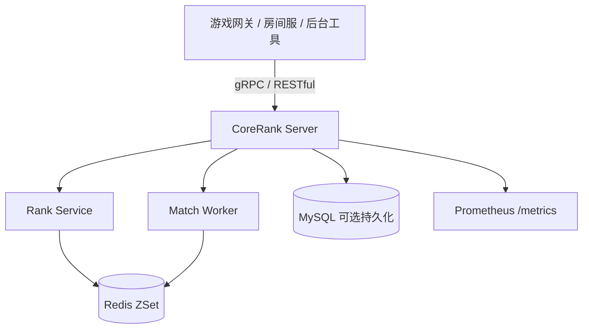

# CoreRank

CoreRank 是一个面向竞技游戏服务端场景的 Go 项目，聚焦两个常见中台能力：

- 匹配池：玩家入队、按分数范围摘取候选玩家。
- 排行榜：更新玩家分数、查询 TopN 和个人名次。

项目提供 gRPC 与 RESTful 两种接入方式，核心热数据使用 Redis ZSet 保存，候选玩家摘取通过 Redis Lua 脚本把“查询 + 删除”收敛为一次原子执行，降低并发重复匹配风险。

当前定位是：

```text
Go 游戏匹配与排行榜中台
```

它不是完整游戏服务器，也不包含真实战斗服、房间服、账号体系或生产级 Redis Cluster 部署。

## 当前已实现

- Go 服务端入口：`cmd/server`
- gRPC 排行榜接口：`UpdateScore`、`GetTopRank`
- gRPC 匹配生命周期接口：`CreateMatchTicket`、`GetMatchTicket`、`CancelMatchTicket`、`GetMatchResult`
- RESTful 调试与联调接口
- Redis ZSet 匹配池与排行榜
- Redis Lua 候选玩家原子摘取
- RESTful 匹配票据生命周期：创建、取消、查询票据、查询匹配结果
- Redis 短期保存 `MatchTicket` 与 `MatchResult`
- 匹配票据超时扫描：到期 queued 票据会推进为 `timeout`
- 房间分配抽象：默认生成逻辑 `room_id`，可替换为真实房间服分配实现
- MySQL 可选持久化：玩家分数、匹配票据、匹配结果、榜单快照
- MySQL 故障降级：默认保持 Redis 主链路可用，持久化失败时记录 warning
- 积分桶扫描与滑动窗口匹配 Worker
- Prometheus `/metrics` 指标端点：gRPC 请求、延迟、匹配成功、取消、超时、票据终态耗时、queued 数量
- RESTful API 与 Prometheus metrics server 支持退出信号下优雅关闭
- gRPC Robot 压测程序，支持通过环境变量调整目标地址、并发数和请求数
- RESTful 演示脚本
- Redis 关键路径测试
- GitHub Actions CI 基线，使用 Node 24 运行时版本的官方 actions

## 当前未实现

- 匹配结果通知
- 真实房间服或战斗服调度
- JWT 或账号鉴权
- Redis Cluster 实测部署
- P95/P99 延迟采集
- 生产级高可用部署

这些内容是后续优化方向，未实现前不应写进简历正文。

## 架构概览



分层结构：

| 目录 | 说明 |
|---|---|
| `cmd/server` | 服务端入口，启动 Redis、gRPC、RESTful、Prometheus 和匹配 Worker |
| `cmd/robot` | gRPC 压测机器人 |
| `api/proto` | Protobuf 协议和生成代码 |
| `internal/handler` | gRPC 与 RESTful handler |
| `internal/service` | 排行榜服务与匹配 Worker |
| `internal/repository` | Redis 仓库层与 Lua 脚本 |
| `internal/repository/mysql_schema.sql` | MySQL 表结构 |
| `internal/metrics` | Prometheus 指标定义 |
| `pkg/redis` | Redis 客户端封装 |
| `scripts` | RESTful 演示脚本 |
| `docs` | 验证、面试讲法和优化方案文档 |

## 快速开始

### 1. 启动依赖

当前最小运行依赖是 Redis。

```powershell
docker compose up -d corerank-redis
```

如果需要 Redis、MySQL、Prometheus 和 Grafana 本地演示栈：

```powershell
docker compose up -d corerank-redis corerank-mysql prometheus grafana
```

### 2. 启动服务端

```powershell
go run ./cmd/server
```

如需启用 MySQL 持久化：

```powershell
$env:CORERANK_MYSQL_DSN="corerank:<password>@tcp(127.0.0.1:3306)/corerank?parseTime=true&charset=utf8mb4&loc=Local"
go run ./cmd/server
```

如果使用本仓库 Docker Compose 启动的 MySQL，默认端口是 `3307`：

```powershell
$env:CORERANK_MYSQL_DSN="corerank:corerank_demo@tcp(127.0.0.1:3307)/corerank?parseTime=true&charset=utf8mb4&loc=Local"
go run ./cmd/server
```

默认情况下，MySQL 是可选持久化层。即使 DSN 连接失败，或服务运行中 MySQL 写入失败，CoreRank 也会继续使用 Redis 主链路处理排行榜和匹配请求，并在日志中记录 warning。

如需在测试或演示中强制要求 MySQL 可用：

```powershell
$env:CORERANK_MYSQL_REQUIRED="true"
```

默认端口：

| 服务 | 默认地址 |
|---|---|
| gRPC | `:8080` |
| RESTful | `:8081` |
| Prometheus metrics | `:9091` |
| Prometheus | `http://localhost:9090` |
| Grafana | `http://localhost:3000` |

可通过环境变量改端口：

```powershell
$env:GRPC_ADDR="127.0.0.1:18080"
$env:HTTP_ADDR="127.0.0.1:18081"
$env:METRICS_ADDR="127.0.0.1:19091"
go run ./cmd/server
```

### 3. 运行 RESTful 演示

```powershell
python scripts\rest_demo.py
```

MySQL 集成测试需要显式提供测试 DSN：

```powershell
$env:CORERANK_TEST_MYSQL_DSN="corerank:<password>@tcp(127.0.0.1:3306)/corerank_test?parseTime=true&charset=utf8mb4&loc=Local"
go test ./...
```

演示覆盖：

- 更新玩家分数。
- 查询 TopN 排行榜。
- 查询单个玩家名次。
- 玩家加入匹配池。
- 创建匹配票据。
- 查询匹配结果。

### 4. 运行 gRPC Robot

先启动服务端，再另开终端执行：

```powershell
go run ./cmd/robot
```

Robot 默认模拟：

- 100 个 goroutine。
- 每个 goroutine 发送 100 次 `UpdateScore`。
- 总计 10000 次 gRPC 请求。

可通过环境变量调整：

```powershell
$env:ROBOT_GRPC_ADDR="localhost:8080"
$env:ROBOT_WORKERS="100"
$env:ROBOT_REQUESTS_PER_WORKER="100"
go run ./cmd/robot
```

性能数字只代表当前机器、当前 Redis 和当前测试参数，不代表生产承诺。

## 验证命令

推荐每次改动后执行：

```powershell
$env:GOCACHE = Join-Path (Get-Location) ".gocache"
go test ./...
go vet ./...
python scripts\rest_demo.py
```

更多测试策略见：

- [验证指南](./docs/verification.md)
- [优化方案与测试策略](./docs/optimization-and-testing-plan.md)

## 当前可写进简历的边界

可以写：

- Go + gRPC/RESTful 实现匹配池、匹配票据与排行榜服务。
- Redis ZSet 承载匹配池和排行榜热数据。
- Redis Lua 将候选玩家查询与删除合并为原子操作。
- Redis Hash 保存短期匹配票据和匹配结果。
- RESTful 和 gRPC API 支持创建/取消匹配票据、查询票据和查询匹配结果。
- 匹配票据支持超时扫描，超时玩家可重新入队。
- 匹配成功通过可替换的房间分配抽象生成逻辑 `room_id`。
- MySQL 可选持久化玩家分数、匹配票据、匹配结果和榜单快照。
- MySQL 故障时默认降级到 Redis 主链路，避免可选持久化层中断核心请求。
- Prometheus 指标暴露。
- Prometheus 已记录匹配成功、取消、超时、票据生命周期耗时和 queued 数量等业务指标。
- RESTful API 和 Prometheus metrics server 支持优雅关闭。
- Robot 压测脚本和 RESTful 演示脚本。
- 本机 10000 次 gRPC 请求验证成功率 100%，但必须标注本机环境和测试参数。

不建议写：

- 已生产落地。
- 已支持 Redis Cluster。
- 完整游戏服务器。
- 完整房间/战斗服调度。
- P99 延迟数据。

## 后续优化路线

执行顺序：

1. 可信展示基线：README、CI、验证文档、Git 状态整理。
2. 匹配生命周期闭环：RESTful/gRPC `MatchTicket` 创建、取消、超时扫描、查询和 `MatchResult` 查询已完成；真实房间服分配待补。
3. MySQL 持久化证据链：玩家、匹配票据、匹配结果、榜单快照已接入；基础故障降级已完成，后续继续补更细的业务查询和索引说明。
4. 可观测性与公开文档：HTTP/metrics 优雅关闭、真实匹配指标、本机压测记录、API 文档和架构文档已补；Grafana/服务器部署验证仍待补。

## 文档

- [验证指南](./docs/verification.md)
- [API 文档](./docs/api.md)
- [架构文档](./docs/architecture.md)
- [本地测试与面试演示指南](./docs/demo-guide.md)
- [本地观测栈](./docs/observability.md)
- [优化方案与测试策略](./docs/optimization-and-testing-plan.md)
- [压测记录](./docs/benchmark.md)
- [面试讲法](./docs/interview-notes.md)
- [2026-05-06 验证记录](./docs/verification-2026-05-06.md)
- [技术报告](./CoreRank_Technical_Report.md)
- [项目提案](./CoreRank_Proposal.md)
