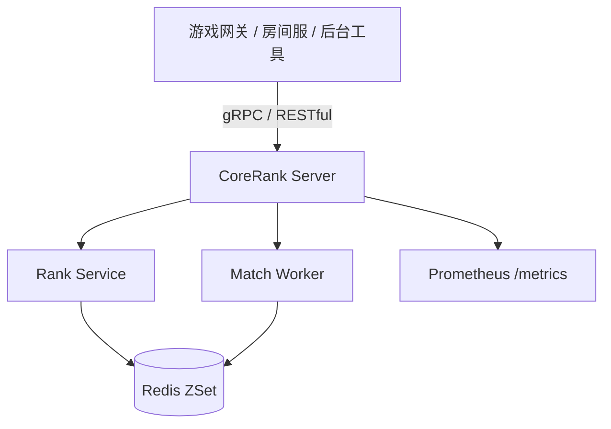

# CoreRank

CoreRank 是一个面向竞技游戏服务端场景的 Go 项目，聚焦两个常见中台能力：

- 匹配池：玩家入队、按分数范围摘取候选玩家。
- 排行榜：更新玩家分数、查询 TopN 和个人名次。

项目提供 gRPC 与 RESTful 两种接入方式，核心热数据使用 Redis ZSet 保存，候选玩家摘取通过 Redis Lua 脚本把“查询 + 删除”收敛为一次原子执行，降低并发重复匹配风险。

当前定位是：

```text
Go 游戏匹配与排行榜中台
```

它不是完整游戏服务器，也不包含真实战斗服、房间服、账号体系或生产级 Redis Cluster 部署。

## 当前已实现

- Go 服务端入口：`cmd/server`
- gRPC 排行榜接口：`UpdateScore`、`GetTopRank`
- RESTful 调试与联调接口
- Redis ZSet 匹配池与排行榜
- Redis Lua 候选玩家原子摘取
- RESTful 匹配票据生命周期：创建、取消、查询票据、查询匹配结果
- Redis 短期保存 `MatchTicket` 与 `MatchResult`
- 积分桶扫描与滑动窗口匹配 Worker
- Prometheus `/metrics` 指标端点
- gRPC Robot 压测程序
- RESTful 演示脚本
- Redis 关键路径测试
- GitHub Actions CI 基线

## 当前未实现

- MySQL 持久化
- gRPC 匹配票据生命周期接口
- 匹配结果通知
- 房间服或战斗服分配
- JWT 或账号鉴权
- Redis Cluster 实测部署
- P95/P99 延迟采集
- 生产级高可用部署

这些内容是后续优化方向，未实现前不应写进简历正文。

## 架构概览



分层结构：

| 目录 | 说明 |
|---|---|
| `cmd/server` | 服务端入口，启动 Redis、gRPC、RESTful、Prometheus 和匹配 Worker |
| `cmd/robot` | gRPC 压测机器人 |
| `api/proto` | Protobuf 协议和生成代码 |
| `internal/handler` | gRPC 与 RESTful handler |
| `internal/service` | 排行榜服务与匹配 Worker |
| `internal/repository` | Redis 仓库层与 Lua 脚本 |
| `internal/metrics` | Prometheus 指标定义 |
| `pkg/redis` | Redis 客户端封装 |
| `scripts` | RESTful 演示脚本 |
| `docs` | 验证、面试讲法和优化方案文档 |

## 快速开始

### 1. 启动依赖

当前最小运行依赖是 Redis。

```powershell
docker compose up -d corerank-redis
```

如果需要 Prometheus 和 Grafana：

```powershell
docker compose up -d
```

### 2. 启动服务端

```powershell
go run ./cmd/server
```

默认端口：

| 服务 | 默认地址 |
|---|---|
| gRPC | `:8080` |
| RESTful | `:8081` |
| Prometheus metrics | `:9091` |

可通过环境变量改端口：

```powershell
$env:GRPC_ADDR="127.0.0.1:18080"
$env:HTTP_ADDR="127.0.0.1:18081"
$env:METRICS_ADDR="127.0.0.1:19091"
go run ./cmd/server
```

### 3. 运行 RESTful 演示

```powershell
python scripts\rest_demo.py
```

演示覆盖：

- 更新玩家分数。
- 查询 TopN 排行榜。
- 查询单个玩家名次。
- 玩家加入匹配池。
- 创建匹配票据。
- 查询匹配结果。

### 4. 运行 gRPC Robot

先启动服务端，再另开终端执行：

```powershell
go run ./cmd/robot
```

Robot 默认模拟：

- 100 个 goroutine。
- 每个 goroutine 发送 100 次 `UpdateScore`。
- 总计 10000 次 gRPC 请求。

性能数字只代表当前机器、当前 Redis 和当前测试参数，不代表生产承诺。

## 验证命令

推荐每次改动后执行：

```powershell
$env:GOCACHE = Join-Path (Get-Location) ".gocache"
go test ./...
go vet ./...
python scripts\rest_demo.py
```

更多测试策略见：

- [验证指南](./docs/verification.md)
- [优化方案与测试策略](./docs/optimization-and-testing-plan.md)

## 当前可写进简历的边界

可以写：

- Go + gRPC/RESTful 实现匹配池与排行榜服务。
- Redis ZSet 承载匹配池和排行榜热数据。
- Redis Lua 将候选玩家查询与删除合并为原子操作。
- Redis Hash 保存短期匹配票据和匹配结果。
- RESTful API 支持创建/取消匹配票据、查询票据和查询匹配结果。
- Prometheus 指标暴露。
- Robot 压测脚本和 RESTful 演示脚本。
- 本机 10000 次 gRPC 请求验证成功率 100%，但必须标注本机环境和测试参数。

不建议写：

- 已生产落地。
- 已支持 Redis Cluster。
- 完整游戏服务器。
- 完整房间/战斗服调度。
- MySQL 持久化。
- P99 延迟数据。

## 后续优化路线

执行顺序：

1. 可信展示基线：README、CI、验证文档、Git 状态整理。
2. 匹配生命周期闭环：RESTful `MatchTicket` 创建、取消、查询和 `MatchResult` 查询已完成；gRPC 匹配接口、超时扫描和真实房间服分配待补。
3. MySQL 持久化证据链：玩家、匹配票据、匹配结果、榜单快照。
4. 可观测性与公开文档：真实匹配指标、API 文档、架构文档、压测报告。

## 文档

- [验证指南](./docs/verification.md)
- [优化方案与测试策略](./docs/optimization-and-testing-plan.md)
- [面试讲法](./docs/interview-notes.md)
- [2026-05-06 验证记录](./docs/verification-2026-05-06.md)
- [技术报告](./CoreRank_Technical_Report.md)
- [项目提案](./CoreRank_Proposal.md)
