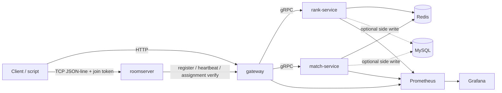

# CoreRank

CoreRank 是一个面向竞技游戏场景的 Go 匹配、排行榜和轻量房间资源分配服务。项目以 Redis 为热路径事实源，通过 gRPC 拆分 rank/match 服务，并以 HTTP gateway 和 TCP roomserver 组成可本地验证的分布式演示栈。

## 当前能力

- RankService：整数分数写入、多榜单 TopN/分页、玩家排名、真实榜单总人数。
- MatchService：MatchTicket 创建、查询、取消、超时、结果查询和后台滑动窗口匹配。
- 多模式隔离：每个 `match_mode` 使用独立 Redis ZSet 与 Worker 窗口，完成匹配前再次校验全部 ticket 模式。
- 原子状态机：ticket 创建、取消、完成、超时通过 Redis Lua 执行 CAS/事务边界。
- 房服容量：分离 allocator 预留负载和 roomserver 实报负载，心跳不会覆盖预留；结算/失败释放槽位，异常遗留由 2 小时 lease 回收。
- 原子结算：校验完整参赛者集合，批量写榜、记录幂等指纹、标记结算并释放容量。
- 可信 join：匹配结果携带 `join_token`，roomserver 校验 match/room/server/player/token 后才允许加入。
- 可选 MySQL：Redis 成功后的同步旁路落库和榜单快照，不作为 Redis 恢复源。
- Prometheus/Grafana、Docker Compose、Redis/MySQL 集成测试、smoke/soak 和 GitHub Actions。

## 架构


```mermaid
flowchart LR
    Client["Client / script"] -->|HTTP| Gateway["gateway"]
    Gateway -->|gRPC| Rank["rank-service"]
    Gateway -->|gRPC| Match["match-service"]
    Room["roomserver"] -->|register / heartbeat / assignment verify| Gateway
    Client -->|TCP JSON-line + join token| Room
    Rank --> Redis[(Redis)]
    Match --> Redis
    Rank -. optional side write .-> MySQL[(MySQL)]
    Match -. optional side write .-> MySQL
    Gateway --> Prometheus
    Rank --> Prometheus
    Match --> Prometheus
    Prometheus --> Grafana
```

Redis 是当前主链路事实源。MySQL 写失败只记录日志，不回滚 Redis；项目没有实现 MySQL outbox、恢复回放或双写强一致。

## 快速开始

1. 复制本地配置并替换密码：

```powershell
Copy-Item .env.example .env
```

2. 构建并启动本地栈：

```powershell
docker compose build corerank-rank-service corerank-match-service corerank-gateway corerank-roomserver
docker compose up -d corerank-redis corerank-rank-service corerank-match-service corerank-gateway corerank-roomserver prometheus grafana
```

3. 验证：

```powershell
powershell -ExecutionPolicy Bypass -File scripts\distributed_smoke.ps1
```

设置 `.env` 中的 `CORERANK_API_KEY` 后，smoke 会自动从同名环境变量携带 API key。Docker Compose 的主机端口默认全部绑定到 `127.0.0.1`。

## 默认地址

| 组件 | 地址 |
|---|---|
| Gateway liveness | `http://127.0.0.1:8081/healthz` |
| Gateway readiness（gRPC 服务及 Redis） | `http://127.0.0.1:8081/readyz` |
| Gateway metrics | `http://127.0.0.1:19080/metrics` |
| RankService gRPC / metrics | `127.0.0.1:18081` / `http://127.0.0.1:19081/metrics` |
| MatchService gRPC / metrics | `127.0.0.1:18082` / `http://127.0.0.1:19082/metrics` |
| RoomServer TCP | `127.0.0.1:7001` |
| Prometheus / Grafana | `http://127.0.0.1:9090` / `http://127.0.0.1:3000` |

## 常用命令

```powershell
go test ./...
go vet ./...
go build ./cmd/gateway ./cmd/rank-service ./cmd/match-service ./cmd/roomserver
scripts\generate_proto.ps1
```

```powershell
python scripts\room_tcp_demo.py
powershell -ExecutionPolicy Bypass -File scripts\distributed_smoke.ps1
powershell -ExecutionPolicy Bypass -File scripts\distributed_soak.ps1 -DurationMinutes 10
```

旧的 `cmd/server` 单进程入口仍保留作兼容和对照，不是当前推荐部署形态。

## 关键约束

- HTTP body 最大 64 KiB；gateway 默认 3 秒后端超时和 256 并发请求上限。
- 排名 TopN 最大 100；MMR 为 0–10000；显式 `max_wait_ms` 为 1 秒–10 分钟。
- roomserver 单条消息最大 64 KiB、30 秒空闲超时、默认 1024 并发连接。
- `CORERANK_API_KEY` 提供本地共享环境的轻量保护；它不是账号/JWT 或服务级 mTLS。
- 内部 gRPC 当前使用明文连接，适用于本机或 Compose 私有网络，不应直接暴露到不可信网络。

## 目录

```text
api/proto/              Protobuf 协议与生成代码
cmd/gateway/            HTTP gateway
cmd/rank-service/       排行榜 gRPC 服务
cmd/match-service/      匹配 gRPC 服务与 MatchWorker
cmd/roomserver/         TCP JSON-line roomserver
internal/handler/       HTTP / gRPC handler
internal/service/       排名、匹配、结算与分配逻辑
internal/repository/    Redis、MySQL 与 Lua 原子脚本
internal/roomserver/    TCP 房间状态与 join 校验
scripts/                生成、smoke、soak 与演示脚本
docs/                   架构、API、观测和验证文档
```

## 文档

- [API](docs/api.md)
- [架构](docs/architecture.md)
- [本地演示](docs/demo-guide.md)
- [验证](docs/verification.md)
- [可观测性](docs/observability.md)
- [安全策略](SECURITY.md)

## 边界

CoreRank 是本地分布式原型，不是生产级高可用系统。目前不包含完整账号/JWT、外网 TLS/mTLS、可信战斗服身份、Redis Cluster、自动故障转移、服务发现、Kubernetes、分布式追踪或完整战斗逻辑。历史 benchmark 只代表对应机器和测试窗口，不构成生产 TPS/P99 承诺。

## License

本项目使用 [MIT License](LICENSE)。
