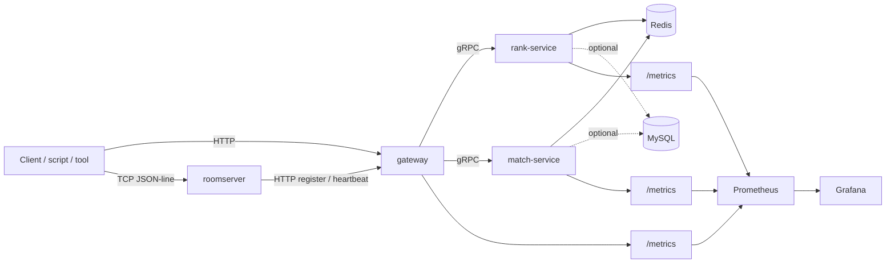

# CoreRank

CoreRank 是一个面向竞技游戏场景的 Go 匹配、排行榜和轻量房间资源分配服务。项目提供 REST 和 gRPC 接口，使用 Redis 承载热路径状态，使用 Redis Lua 脚本保证匹配取人与房间容量预留等关键操作的原子性，并可选使用 MySQL 持久化玩家、匹配票据、匹配结果和榜单快照。

当前本地分布式栈包含：

- `gateway`：对外 HTTP 入口。
- `rank-service`：排行榜 gRPC 服务。
- `match-service`：匹配票据生命周期、房间分配和 MatchWorker gRPC 服务。
- `roomserver`：TCP JSON-line 房间服示例，支持 join/ready/leave。
- `redis`：排行榜、票据、匹配结果、服务注册和房间分配的共享状态存储。
- `mysql`：可选持久化层。
- `prometheus` / `grafana`：本地观测栈。

## 功能

- 排行榜：更新分数、查询 TopN、查询玩家排名。
- 多榜单：支持 `global`、`season:*`、`event:*` 或其他 `leaderboard_type`。
- 匹配票据：创建、查询、取消、超时和匹配结果查询。
- 原子匹配：Redis Lua 将候选玩家选择和移除合并为一次操作。
- 房间资源分配：Redis-backed server registry 记录 roomserver 元数据、心跳、负载和容量。
- TCP roomserver：支持 JSON-line `join`、`ready`、`leave`、`ping` 消息。
- 可选 MySQL 持久化：玩家、匹配票据、匹配结果和榜单快照。
- Prometheus 指标：gRPC 流量、票据事件、匹配生命周期、房间分配和 roomserver 负载。
- Docker Compose 本地分布式验证栈。

## 架构


```mermaid
flowchart LR
    Client["Client / script / tool"] -->|"HTTP"| Gateway["gateway"]
    Gateway -->|"gRPC"| Rank["rank-service"]
    Gateway -->|"gRPC"| Match["match-service"]

    Room["roomserver"] -->|"HTTP register / heartbeat"| Gateway
    Client -->|"TCP JSON-line"| Room

    Rank --> Redis[("Redis")]
    Match --> Redis
    Rank -. optional .-> MySQL[("MySQL")]
    Match -. optional .-> MySQL

    Gateway --> Metrics["/metrics"]
    Rank --> RankMetrics["/metrics"]
    Match --> MatchMetrics["/metrics"]
    Metrics --> Prometheus["Prometheus"]
    RankMetrics --> Prometheus
    MatchMetrics --> Prometheus
    Prometheus --> Grafana["Grafana"]
```

## 快速开始

### 分布式 Compose 栈

构建服务镜像：

```powershell
docker compose build corerank-rank-service corerank-match-service corerank-gateway corerank-roomserver
```

启动本地分布式栈：

```powershell
docker compose up -d corerank-redis corerank-rank-service corerank-match-service corerank-gateway corerank-roomserver prometheus grafana
```

运行分布式 smoke：

```powershell
powershell -ExecutionPolicy Bypass -File scripts\distributed_smoke.ps1
```

该脚本会验证：

- gateway health 和 metrics。
- gateway、rank-service、match-service 连通性。
- `roomserver` 通过 gateway 注册和发送心跳。
- 重复创建 ticket 返回冲突错误。
- queued ticket 可取消，重复取消返回冲突错误。
- 两个匹配票据生成一个匹配结果。
- 匹配结果包含 `ServerID` 和 `ServerAddr`。
- TCP roomserver 完成 `join -> ready -> room_started -> leave`。
- 比赛结算和排行榜查询。
- Prometheus targets 和 Grafana dashboard provisioning。

默认本地地址：

| 组件 | 地址 |
|---|---|
| Gateway HTTP | `http://127.0.0.1:8081` |
| RankService gRPC | `127.0.0.1:18081` |
| MatchService gRPC | `127.0.0.1:18082` |
| RoomServer TCP | `127.0.0.1:7001` |
| Gateway metrics | `http://127.0.0.1:19080/metrics` |
| RankService metrics | `http://127.0.0.1:19081/metrics` |
| MatchService metrics | `http://127.0.0.1:19082/metrics` |
| Prometheus | `http://127.0.0.1:9090` |
| Grafana | `http://127.0.0.1:3000` |

### 单进程兼容模式

旧的单进程入口仍保留，可用于简单调试和对比。

启动 Redis：

```powershell
docker compose up -d corerank-redis
```

启动服务：

```powershell
go run ./cmd/server
```

默认单进程地址：

| 组件 | 地址 |
|---|---|
| gRPC | `127.0.0.1:8080` |
| REST | `http://127.0.0.1:8081` |
| Metrics | `http://127.0.0.1:9091/metrics` |

## 配置

常用分布式环境变量：

| 组件 | 变量 | 默认值 / 示例 |
|---|---|---|
| rank-service | `RANK_GRPC_ADDR` | `:18081` |
| rank-service | `RANK_METRICS_ADDR` | `:19081` |
| match-service | `MATCH_GRPC_ADDR` | `:18082` |
| match-service | `MATCH_METRICS_ADDR` | `:19082` |
| match-service | `MATCH_WORKER_ENABLED` | `true` |
| gateway | `GATEWAY_HTTP_ADDR` | `:8081` |
| gateway | `GATEWAY_METRICS_ADDR` | `:19080` |
| gateway | `RANK_GRPC_TARGET` | `corerank-rank-service:18081` |
| gateway | `MATCH_GRPC_TARGET` | `corerank-match-service:18082` |
| roomserver | `ROOM_SERVER_ID` | `compose-room-1` |
| roomserver | `ROOM_SERVER_ADDR` | `:7001` |
| roomserver | `ROOM_SERVER_PUBLIC_ADDR` | `127.0.0.1:7001` |
| roomserver | `CORE_RANK_HTTP` | `http://corerank-gateway:8081` |
| roomserver | `MATCH_MODE` | `duel` |
| Go 服务 | `REDIS_ADDR` | Compose 中为 `corerank-redis:6379` |
| rank/match service | `CORERANK_MYSQL_DSN` | 可选 |
| rank/match service | `CORERANK_MYSQL_REQUIRED` | `false` |

## 验证

重启后或长时间运行前，先做低负载前置检查：

```powershell
powershell -NoProfile -ExecutionPolicy Bypass -File scripts\stability_preflight.ps1 -CheckEndpoints
```

运行 Go 测试和静态检查：

```powershell
$env:GOCACHE = Join-Path (Get-Location) ".gocache"
go test ./...
go vet ./...
```

运行分布式 smoke：

```powershell
powershell -ExecutionPolicy Bypass -File scripts\distributed_smoke.ps1
```

运行受控长稳探测：

```powershell
powershell -NoProfile -ExecutionPolicy Bypass -File scripts\distributed_soak.ps1 -DurationMinutes 10 -IntervalSeconds 30
```

运行单进程 REST 脚本：

```powershell
python scripts\rest_demo.py
```

运行 TCP roomserver 脚本：

```powershell
python scripts\room_tcp_demo.py
```

运行 gRPC robot：

```powershell
go run ./cmd/robot
```

## 目录结构

```text
api/proto/                 Protobuf 协议和生成代码
cmd/gateway/               分布式 HTTP gateway
cmd/rank-service/          分布式排行榜 gRPC 服务
cmd/match-service/         分布式匹配 gRPC 服务
cmd/roomserver/            TCP JSON-line roomserver 示例
cmd/server/                单进程兼容入口
cmd/robot/                 gRPC 请求工具
internal/handler/          REST 和 gRPC handler
internal/service/          排行榜、匹配、worker 和分配逻辑
internal/repository/       Redis、MySQL 和 Lua 仓库
internal/roomserver/       TCP roomserver 实现
internal/metrics/          Prometheus 指标
pkg/config/                环境变量配置工具
pkg/redis/                 Redis client 封装
scripts/                   本地验证脚本
docs/                      API、架构、验证和运行文档
grafana/                   Grafana provisioning 和 dashboard
```

## 文档

- [API](./docs/api.md)
- [架构](./docs/architecture.md)
- [本地运行与验证](./docs/demo-guide.md)
- [验证指南](./docs/verification.md)
- [观测说明](./docs/observability.md)
- [Agent 接入](./docs/agent-integration.md)
- [分布式改造说明](./docs/distributed-minimal/README.md)
- [压测记录](./docs/benchmark.md)

## 当前边界

- 不包含账号系统、JWT 鉴权或反作弊模块。
- 不包含完整战斗服、帧同步或断线重连。
- 未验证 Redis Cluster。
- 未提供 Kubernetes 配置或生产级服务发现。
- 不提供生产延迟或吞吐承诺。
- TCP roomserver 是本地最小实现，房间状态保存在 roomserver 进程内。

## License

未指定。
