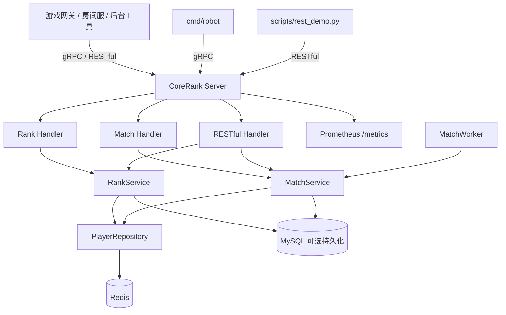

# CoreRank 架构文档

本文档说明 CoreRank 当前架构、数据流、存储分工、可观测性和未完成边界。它面向阅读代码、准备面试和后续继续开发使用。

## 1. 系统定位

CoreRank 是一个游戏匹配与排行榜中台。它通常位于游戏网关、房间服、后台工具和数据存储之间，提供排行榜写入、排行榜查询、匹配票据生命周期和匹配结果查询能力。

当前项目适合作为本地可验证的服务端中台项目，不是完整游戏服务器。

## 2. 总体架构



## 3. 目录分层

| 目录 | 职责 |
|---|---|
| `cmd/server` | 服务端入口，启动 Redis、gRPC、RESTful、metrics 和匹配 Worker |
| `cmd/robot` | gRPC 压测工具 |
| `api/proto` | gRPC Protobuf 协议 |
| `internal/handler` | RESTful 和 gRPC handler |
| `internal/service` | 排行榜、匹配生命周期、Worker 和房间分配抽象 |
| `internal/repository` | Redis、Lua 脚本、MySQL 表结构和仓库实现 |
| `internal/metrics` | Prometheus 指标定义 |
| `pkg/redis` | Redis 客户端初始化 |
| `scripts` | 本地 RESTful 演示脚本 |
| `docs` | 验证、方案、架构、API、压测和演示文档 |

## 4. 启动流程

`cmd/server` 启动时主要完成：

1. 读取环境变量。
2. 初始化 Redis 客户端。
3. 初始化 `PlayerRepository`、`RankService`、`MatchService`。
4. 如果配置了 MySQL DSN，则初始化 MySQL repository。
5. 启动匹配 Worker。
6. 启动 gRPC server。
7. 启动 RESTful HTTP server。
8. 启动 Prometheus metrics HTTP server。
9. 监听退出信号并优雅关闭 gRPC、RESTful、metrics 和 Worker。

## 5. 排行榜链路

### 写入分数

```text
gRPC UpdateScore / REST POST /api/rank/score
  -> RankHandler / HTTPHandler
  -> RankService.UpdatePlayerScore
  -> Redis ZADD rank:global
  -> 可选 MySQL players upsert
```

### 查询 TopN

```text
gRPC GetTopRank / REST GET /api/rank/top
  -> RankService.GetTopPlayers
  -> Redis ZREVRANGE rank:global
  -> 可选 MySQL rank_snapshots 写入
```

### 查询单个玩家排名

```text
REST GET /api/rank/player/{player_id}
  -> RankService.GetPlayerRank
  -> Redis ZREVRANK + ZSCORE
```

## 6. 匹配生命周期链路

### 创建票据

```text
CreateMatchTicket / POST /api/match/tickets
  -> MatchService.CreateTicket
  -> Redis SETNX match:player_ticket:{player_id}
  -> Redis HASH match:ticket:{ticket_id}
  -> Redis ZSET match:ticket_pool
  -> Redis ZSET match:ticket_expiry
  -> 可选 MySQL match_tickets upsert
  -> TryCompleteMatch
```

### 尝试完成匹配

```text
TryCompleteMatch
  -> Redis Lua 原子摘取候选玩家
  -> RoomAllocator 生成逻辑 room_id
  -> Redis HASH match:result:{match_id}
  -> 更新票据为 matched
  -> 删除 player_ticket 防重复 key
  -> 删除超时索引
  -> 可选 MySQL match_results / match_tickets upsert
```

### 取消票据

```text
CancelMatchTicket / DELETE /api/match/tickets/{ticket_id}
  -> 检查票据必须是 queued
  -> 更新状态为 cancelled
  -> 删除 player_ticket key
  -> 从 match:ticket_pool 移除玩家
  -> 从 match:ticket_expiry 移除票据
  -> 可选 MySQL match_tickets upsert
```

### 超时扫描

```text
MatchWorker
  -> MatchService.TimeoutExpiredTickets
  -> Redis ZSET match:ticket_expiry 查询到期 ticket_id
  -> Redis Lua 原子推进 queued -> timeout
  -> 清理 player_ticket 和 match:ticket_pool
  -> 可选 MySQL match_tickets upsert
```

## 7. Redis 数据结构

| Key | 类型 | 说明 |
|---|---|---|
| `{rank:global}` | ZSet | 全局排行榜 |
| `{match:pool}` | ZSet | 早期调试匹配池 |
| `{match:ticket_pool}` | ZSet | 匹配票据玩家池 |
| `{match:ticket_expiry}` | ZSet | 票据超时扫描索引 |
| `match:ticket:{ticket_id}` | Hash | 匹配票据状态 |
| `match:result:{match_id}` | Hash | 匹配结果 |
| `match:player_ticket:{player_id}` | String | 防止同一玩家重复 queued |

## 8. MySQL 表结构

| 表 | 说明 |
|---|---|
| `players` | 玩家分数持久化 |
| `match_tickets` | 匹配票据持久化 |
| `match_results` | 匹配结果持久化 |
| `rank_snapshots` | 榜单快照 |

MySQL 是可选持久化层。默认策略是 Redis 主链路优先，MySQL 写入失败时记录 warning 并继续返回 Redis 结果。

如果需要启动时强制 MySQL 可用：

```powershell
$env:CORERANK_MYSQL_REQUIRED="true"
```

## 9. 可观测性

CoreRank 通过 `/metrics` 暴露 Prometheus 指标。

当前指标覆盖：

- gRPC 请求数量。
- gRPC 请求耗时。
- 匹配成功数量。
- 匹配取消数量。
- 匹配超时数量。
- 票据事件数量。
- 票据生命周期耗时。
- queued 票据数量。

当前边界：

- 已有 Prometheus 抓取配置。
- Grafana dashboard provisioning 已完成本地验证。
- 已有本机 Prometheus P95/P99 短窗口查询记录；仍不能写成生产性能承诺。

## 10. 部署形态

### 本地开发

适合：

- 写代码。
- 跑 `go test`。
- 跑 REST demo。
- 跑 Robot。
- 查看 `/metrics`。

### Docker Compose 演示

当前已有 Redis、MySQL、Prometheus、Grafana 配置。MySQL 默认映射到宿主机 `3307`，避免和本机已有 MySQL `3306` 冲突。

### Linux 云服务器演示

尚未验证。后续如需增强面试演示，可把 CoreRank、Redis、MySQL、Prometheus、Grafana 放到一台 Linux 云服务器或 Docker Compose 环境中。

## 11. 当前未实现边界

- 真实房间服 / 战斗服资源分配。
- 匹配结果主动通知。
- JWT / 账号鉴权。
- Redis Cluster。
- 多实例高可用。
- Grafana dashboard。
- Linux 云服务器部署验证。
- 生产级 P95/P99。

## 12. 后续演进建议

优先级建议：

1. 验证 Docker Compose + MySQL + Prometheus + Grafana 本地演示栈。
2. 记录 Prometheus/Grafana 查询到的本地 P95/P99。
3. 做真实房间服 / 战斗服分配前，先设计资源状态、失败回滚和接口契约。
4. 再考虑 Linux 云服务器部署验证。
