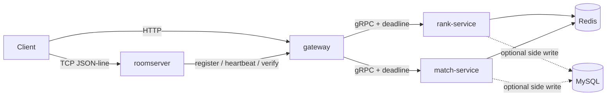
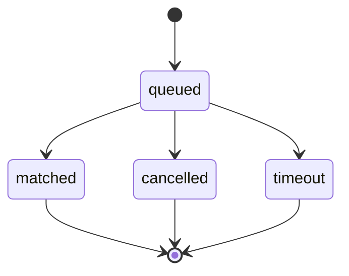

# CoreRank 架构

## 组件

```mermaid
flowchart LR
    C["Client"] -->|HTTP| G["gateway"]
    G -->|gRPC + deadline| R["rank-service"]
    G -->|gRPC + deadline| M["match-service"]
    RS["roomserver"] -->|register / heartbeat / verify| G
    C -->|TCP JSON-line| RS
    R --> Redis[(Redis)]
    M --> Redis
    R -. optional side write .-> MySQL[(MySQL)]
    M -. optional side write .-> MySQL
```

| 组件 | 职责 |
|---|---|
| gateway | HTTP 契约、body/并发/超时保护、API key、gRPC 错误映射、readiness |
| rank-service | 排行榜写入、分页查询、玩家排名和原子结算 |
| match-service | MatchTicket 状态机、按模式匹配、房服注册与分配 |
| roomserver | 最小 TCP join/ready/leave 状态，assignment token 校验 |
| Redis | 排行榜、ticket、result、结算幂等、server registry 与 reservation 的事实源 |
| MySQL | 可选的 Redis 后同步旁路写入和快照，不参与恢复或 Redis Lua 原子边界 |

两个 gRPC 服务注册标准 health service，并每 2 秒用 Redis ping 更新 serving 状态。gateway 启动时检查后端，并通过 `/readyz` 持续提供 gRPC 与 Redis 依赖就绪状态；`/healthz` 只代表 gateway 进程存活。

## MatchTicket 状态机

```mermaid
stateDiagram-v2
    [*] --> queued
    queued --> matched
    queued --> cancelled
    queued --> timeout
    matched --> [*]
    cancelled --> [*]
    timeout --> [*]
```

创建、取消、完成和超时都使用 Lua。完成脚本会一次校验全部 player-ticket 映射、ticket 状态和 `match_mode`，然后提交 ticket 终态与 MatchResult，避免 read + pipeline 的 check-then-act 竞态。

## 按模式匹配

队列 key 为 `{match:ticket_pool:<mode>}`，`{match:ticket_modes}` 记录当前非空模式。MatchWorker 逐模式维护独立的分数桶和滑动窗口；一个模式的空匹配次数不会扩大另一个模式的搜索范围。

匹配流程：

1. 创建 ticket 并加入对应模式的 ZSet。
2. 请求链路或 Worker 原子摘取同模式、相近 MMR 的两个玩家。
3. allocator 在 Redis 中原子预留 roomserver 槽位。
4. 完成脚本再次校验 ticket 状态与模式，写入 MatchResult 和 `join_token`。
5. 保存 `room:assignment:{match_id}`，供结算释放资源。
6. 任何完成失败都会释放已分配槽位并把仍可用的 ticket 重新排队。

## 房服负载模型

`GameServer` 有两个不同语义的负载：

- `current_load`：allocator 的 reserved slots。
- `observed_load`：roomserver 心跳实报的连接玩家数。

分配 Lua 只修改 reservation；heartbeat 只修改 observed load 和存活时间。重复注册会保留 reservation。结算 Lua 只在 assignment 仍为 `assigned` 时释放一次，因此幂等重放不会重复扣减。

assignment Hash 保留 24 小时，同时写入独立的 2 小时 reservation lease 索引。MatchWorker 每 10 秒扫描到期 lease，并通过幂等释放脚本恢复容量；正常结算和失败释放会移除索引。当前 join 不延长 lease，因此超过 2 小时的超长对局不属于本地 v1 的保证范围。

## 原子结算

RankService 在进入 Lua 前验证：

- match 存在且状态为 `matched`；
- scores 数量与参赛者集合完全一致；
- 没有重复、缺失或 outsider；
- 榜单、玩家 ID 和整数分数符合边界。

结算 payload 按玩家 ID 排序后计算 SHA-256 指纹。Lua 原子完成榜单批量 ZADD、指纹/结算状态写入、MatchResult 标记和 room reservation 释放。同一指纹重放返回 idempotent；不同指纹冲突且不改数据。

## RoomServer join

客户端从 MatchResult 得到 `match_id`、`room_id`、`server_id`、`server_addr` 和 `join_token`。roomserver 收到 join 后向 gateway 查询结果并验证五项信息与玩家成员资格。错误 token 或 outsider 不能创建房间状态。

TCP 入口还有 64 KiB 消息上限、30 秒空闲超时、默认 1024 连接上限和断连清理。它仍是最小房间原型，不实现战斗帧同步、重连或跨进程房间迁移。

## Redis key

| Key | 类型 | 说明 |
|---|---|---|
| `{rank:global}` / `{rank:<type>}` | ZSet | 排行榜 |
| `{match:ticket_pool:<mode>}` | ZSet | 按模式隔离的 ticket 玩家队列 |
| `{match:ticket_modes}` | Set | 当前非空模式 |
| `{match:ticket_expiry}` | ZSet | 超时索引 |
| `match:ticket:{ticket_id}` | Hash | ticket 状态 |
| `match:player_ticket:{player_id}` | String | 玩家当前 queued ticket |
| `match:result:{match_id}` | Hash | 匹配结果与 join token |
| `match:settlement:{match_id}` | Hash | 结算指纹与状态 |
| `server:info:{server_id}` | Hash | 容量、reserved/observed load、心跳 |
| `server:load:{mode}` | ZSet | 按 reserved ratio 排序的 server |
| `room:assignment:{match_id}` | Hash | match 到房服的 reservation |

## 故障与一致性边界

- Redis 是单实例本地事实源；启动时 ping 失败会 fail fast，没有 Cluster 或自动故障转移。
- MySQL 写失败不会回滚 Redis；没有 outbox、补偿队列或自动对账。
- 结算 Lua、ticket Lua 和 reservation Lua 各自定义清晰的原子边界，不等于跨服务分布式事务。
- 内部 gRPC 在本机/Compose 私有网络使用明文连接；外网部署需要 TLS/mTLS 和正式服务身份。
- API key 是本地共享环境的轻量保护，不是账号权限系统。

## 部署边界

推荐形态是 Docker Compose 的 gateway/rank/match/roomserver 四进程栈。`cmd/server` 只保留 legacy 对照。项目不声称生产级高可用、Kubernetes、服务发现、完整战斗服或生产 P99/TPS。
