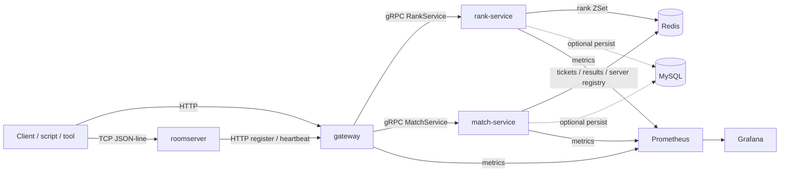
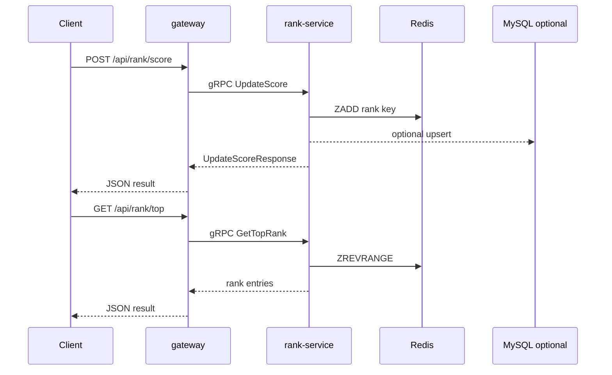
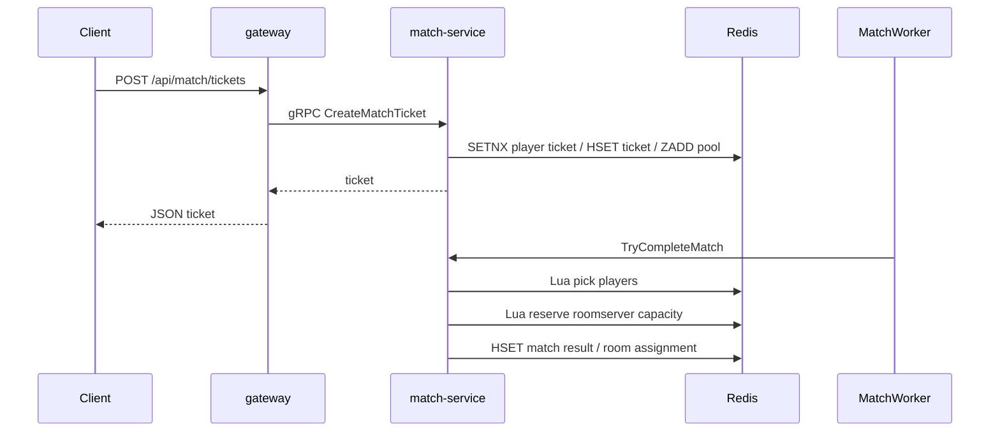
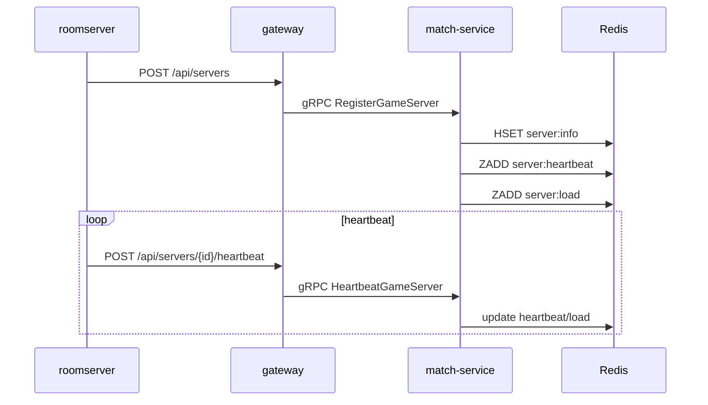

# CoreRank 架构文档

本文档说明 CoreRank 当前架构、服务职责、数据流、存储分工、可观测性和未完成边界。内容以当前代码和本地验证结果为准。

## 1. 系统定位

CoreRank 是一个游戏匹配与排行榜服务。它位于客户端、网关、房间服、后台工具和数据存储之间，提供以下能力：

- 排行榜写入、TopN 查询和玩家排名查询。
- 匹配票据创建、查询、取消、超时和匹配结果查询。
- 基于 Redis 的 roomserver 注册、心跳、负载记录和容量预留。
- 最小 TCP roomserver 流程，用于验证玩家进入房间、准备、开始和离开。
- Prometheus 指标输出和本地 Grafana dashboard。

当前项目不是完整游戏服务器，不包含账号系统、反作弊、完整战斗逻辑、帧同步或生产级服务发现。

## 2. 当前分布式架构


```mermaid
flowchart LR
    Client["Client / script / tool"] -->|"HTTP"| Gateway["gateway"]
    Gateway -->|"gRPC RankService"| Rank["rank-service"]
    Gateway -->|"gRPC MatchService"| Match["match-service"]

    Room["roomserver"] -->|"HTTP register / heartbeat"| Gateway
    Client -->|"TCP JSON-line"| Room

    Rank -->|"rank ZSet"| Redis[("Redis")]
    Match -->|"tickets / results / server registry"| Redis

    Rank -. optional persist .-> MySQL[("MySQL")]
    Match -. optional persist .-> MySQL

    Gateway -->|"metrics"| Prometheus["Prometheus"]
    Rank -->|"metrics"| Prometheus
    Match -->|"metrics"| Prometheus
    Prometheus --> Grafana["Grafana"]
```

## 3. 服务职责

| 服务 | 入口 | 职责 |
|---|---|---|
| `gateway` | `cmd/gateway` | 对外 HTTP API，参数校验，错误码转换，调用内部 gRPC 服务 |
| `rank-service` | `cmd/rank-service` | 排行榜写入、TopN 查询、玩家排名查询，暴露 RankService gRPC |
| `match-service` | `cmd/match-service` | 匹配票据生命周期、MatchWorker、roomserver registry、房间容量预留，暴露 MatchService gRPC |
| `roomserver` | `cmd/roomserver` | TCP JSON-line 房间服示例，启动后向 gateway 注册并发送心跳 |
| `cmd/server` | legacy single-process | 单进程兼容入口，保留用于本地对比和简单开发 |
| `cmd/robot` | client tool | gRPC 请求生成工具 |

## 4. 目录分层

| 目录 | 职责 |
|---|---|
| `api/proto` | gRPC Protobuf 协议和生成代码 |
| `cmd/gateway` | 分布式 HTTP gateway 入口 |
| `cmd/rank-service` | 分布式排行榜服务入口 |
| `cmd/match-service` | 分布式匹配服务入口 |
| `cmd/roomserver` | TCP roomserver 入口 |
| `cmd/server` | 单进程兼容入口 |
| `internal/handler` | RESTful 和 gRPC handler |
| `internal/service` | 排行榜、匹配生命周期、Worker 和房间资源分配 |
| `internal/repository` | Redis、Lua 脚本、MySQL 表结构和仓库实现 |
| `internal/roomserver` | TCP roomserver 协议和房间状态 |
| `internal/metrics` | Prometheus 指标定义 |
| `pkg/config` | 环境变量读取工具 |
| `pkg/redis` | Redis 客户端初始化 |
| `scripts` | 本地验证脚本 |
| `docs` | API、架构、验证和运行说明 |

## 5. 启动流程

### 5.1 gateway

1. 读取 `GATEWAY_HTTP_ADDR`、`GATEWAY_METRICS_ADDR`、`RANK_GRPC_TARGET`、`MATCH_GRPC_TARGET`。
2. 建立到 `rank-service` 和 `match-service` 的 gRPC client。
3. 启动 HTTP API。
4. 启动 Prometheus metrics 端点。
5. 等待退出信号并优雅关闭。

### 5.2 rank-service

1. 读取 Redis、gRPC、metrics 和可选 MySQL 配置。
2. 初始化 Redis client 和 `PlayerRepository`。
3. 可选初始化 MySQL repository。
4. 注册 RankService gRPC handler。
5. 启动 metrics 端点。

### 5.3 match-service

1. 读取 Redis、gRPC、metrics、worker 和可选 MySQL 配置。
2. 初始化 Redis client、`PlayerRepository` 和 `RoomServerRepository`。
3. 初始化 `MatchService`，并启用 Redis-backed room allocator。
4. 启动 `MatchWorker`。
5. 注册 MatchService gRPC handler。
6. 启动 metrics 端点。

### 5.4 roomserver

1. 读取 `ROOM_SERVER_ID`、`ROOM_SERVER_ADDR`、`ROOM_SERVER_PUBLIC_ADDR`、`CORE_RANK_HTTP`、`MATCH_MODE`、`CAPACITY`。
2. 向 gateway 注册自身 server 信息。
3. 周期性发送 heartbeat。
4. 监听 TCP JSON-line 请求。
5. 在本进程内维护最小房间状态。

## 6. 排行榜链路


```mermaid
sequenceDiagram
    participant C as Client
    participant G as gateway
    participant R as rank-service
    participant Redis as Redis
    participant M as MySQL optional

    C->>G: POST /api/rank/score
    G->>R: gRPC UpdateScore
    R->>Redis: ZADD rank key
    R-->>M: optional upsert
    R-->>G: UpdateScoreResponse
    G-->>C: JSON result

    C->>G: GET /api/rank/top
    G->>R: gRPC GetTopRank
    R->>Redis: ZREVRANGE
    R-->>G: rank entries
    G-->>C: JSON result
```

## 7. 匹配链路


```mermaid
sequenceDiagram
    participant C as Client
    participant G as gateway
    participant M as match-service
    participant Redis as Redis
    participant W as MatchWorker

    C->>G: POST /api/match/tickets
    G->>M: gRPC CreateMatchTicket
    M->>Redis: SETNX player ticket / HSET ticket / ZADD pool
    M-->>G: ticket
    G-->>C: JSON ticket

    W->>M: TryCompleteMatch
    M->>Redis: Lua pick players
    M->>Redis: Lua reserve roomserver capacity
    M->>Redis: HSET match result / room assignment
```

当没有可用 roomserver 时，已摘取玩家会重新放回匹配池，不会静默丢失。

## 8. RoomServer 注册和分配


```mermaid
sequenceDiagram
    participant R as roomserver
    participant G as gateway
    participant M as match-service
    participant Redis as Redis

    R->>G: POST /api/servers
    G->>M: gRPC RegisterGameServer
    M->>Redis: HSET server:info
    M->>Redis: ZADD server:heartbeat
    M->>Redis: ZADD server:load

    loop heartbeat
        R->>G: POST /api/servers/{id}/heartbeat
        G->>M: gRPC HeartbeatGameServer
        M->>Redis: update heartbeat/load
    end
```

匹配完成后，结果中会包含：

- `RoomID`：逻辑房间 ID。
- `ServerID`：分配到的 roomserver ID。
- `ServerAddr`：客户端可连接的 TCP 地址。

## 9. Redis 数据结构

| Key | 类型 | 说明 |
|---|---|---|
| `{rank:global}` | ZSet | 全局排行榜 |
| `{rank:<leaderboard_type>}` | ZSet | 赛季榜、活动榜或其他排行榜维度 |
| `{match:pool}` | ZSet | 早期调试匹配池 |
| `{match:ticket_pool}` | ZSet | 匹配票据玩家池 |
| `{match:ticket_expiry}` | ZSet | 票据超时扫描索引 |
| `match:ticket:{ticket_id}` | Hash | 匹配票据状态 |
| `match:result:{match_id}` | Hash | 匹配结果 |
| `match:player_ticket:{player_id}` | String | 防止同一玩家重复 queued |
| `server:info:{server_id}` | Hash | 房间服/战斗服资源元数据 |
| `server:heartbeat` | ZSet | server 心跳时间索引 |
| `server:load:{match_mode}` | ZSet | 按匹配模式记录 server 负载 |
| `room:assignment:{match_id}` | Hash | 匹配结果到 server 的分配记录 |

## 10. MySQL 持久化

MySQL 是可选持久化层。默认策略是 Redis 主链路优先，MySQL 写入失败时记录 warning 并继续返回 Redis 结果。

| 表 | 说明 |
|---|---|
| `players` | 玩家分数持久化 |
| `match_tickets` | 匹配票据持久化 |
| `match_results` | 匹配结果持久化 |
| `rank_snapshots` | 榜单快照 |

如果需要启动时强制 MySQL 可用：

```powershell
$env:CORERANK_MYSQL_REQUIRED="true"
```

## 11. 可观测性

当前分布式栈暴露三个 metrics 端点：

| 服务 | Metrics |
|---|---|
| `gateway` | `http://127.0.0.1:19080/metrics` |
| `rank-service` | `http://127.0.0.1:19081/metrics` |
| `match-service` | `http://127.0.0.1:19082/metrics` |

Prometheus targets：

- `corerank-gateway`
- `corerank-rank-service`
- `corerank-match-service`

主要指标覆盖：

- gRPC 请求数量和耗时。
- 匹配成功、取消、超时数量。
- 匹配票据事件和生命周期耗时。
- queued 票据数量。
- 房间资源分配成功/失败数量。
- roomserver 当前预留玩家槽位数。

## 12. 部署形态

### 本地分布式 Compose

当前已验证：

```powershell
docker compose build corerank-rank-service corerank-match-service corerank-gateway corerank-roomserver
docker compose up -d corerank-redis corerank-rank-service corerank-match-service corerank-gateway corerank-roomserver prometheus grafana
powershell -ExecutionPolicy Bypass -File scripts\distributed_smoke.ps1
```

### 单进程兼容模式

`cmd/server` 仍可启动单进程形态，适合简单调试和对比：

```powershell
docker compose up -d corerank-redis
go run ./cmd/server
```

## 13. 当前未实现边界

- WebSocket 房间服。
- 完整战斗服进程。
- 匹配结果主动通知。
- JWT / 账号鉴权。
- Redis Cluster。
- 多实例高可用。
- Kubernetes 配置。
- 生产级 P95/P99 或吞吐承诺。

## 14. 后续演进建议

1. 补充 Linux 容器环境下的持续运行验证。
2. 完善 HTTP handler 单元测试和 gateway 错误码回归。
3. 如继续扩展房间能力，可在当前 TCP roomserver 上补鉴权、断线重连和完整战斗状态同步。
4. 再评估 Redis Cluster、多实例部署、服务发现和 Kubernetes 配置。
