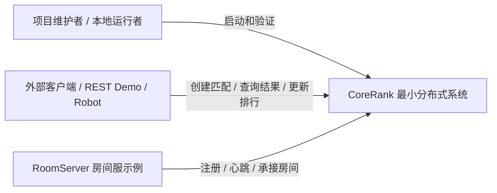
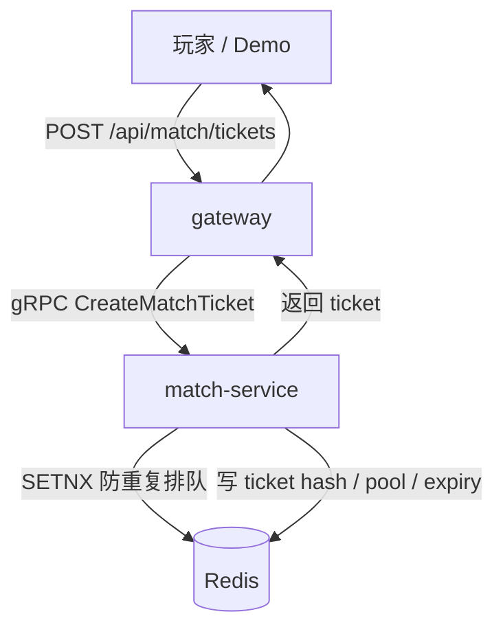
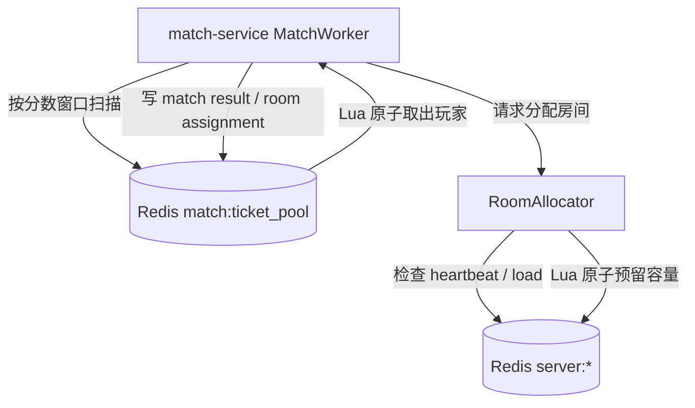
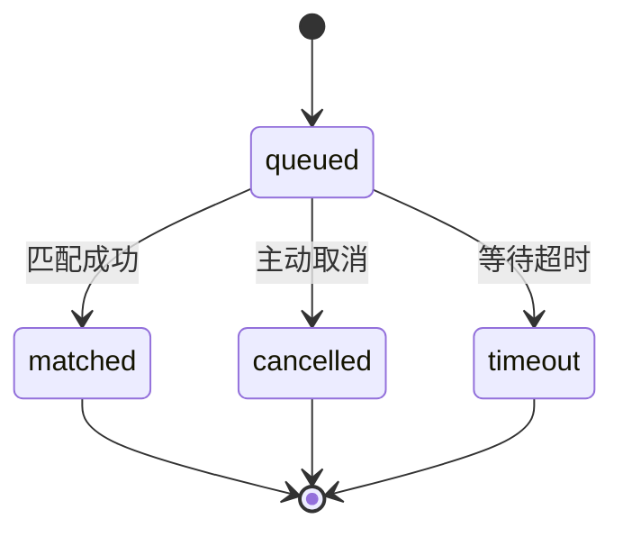
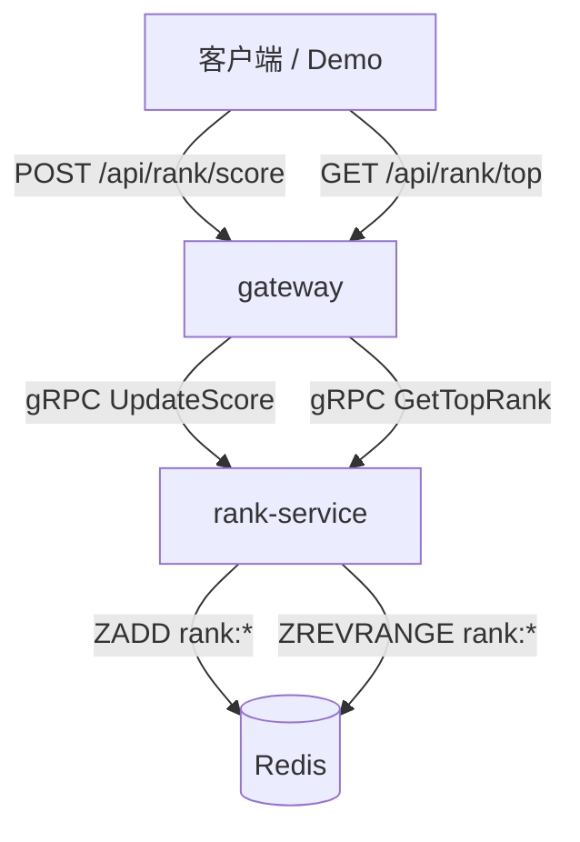
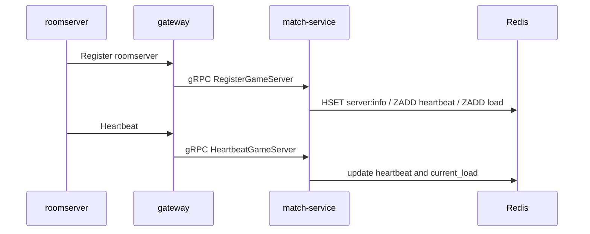

# CoreRank 最小分布式改造需求文档

## 1. 背景

CoreRank 当前是一个 Go 游戏匹配与排行榜服务。现有 `cmd/server` 单进程同时启动：

- RESTful HTTP API
- gRPC RankService
- gRPC MatchService
- RankService 业务逻辑
- MatchService 业务逻辑
- MatchWorker 后台匹配扫描
- Prometheus metrics

同时，`cmd/roomserver` 已经是独立进程，可以向 CoreRank 注册、心跳，并作为房间服示例承接匹配结果。

当前项目已经具备分布式改造基础，但服务边界还停留在代码层面，不是进程和网络层面的服务拆分。

## 2. 改造目标

本次目标是把 CoreRank 升级为“本地最小分布式游戏服务端链路”：

```text
gateway
  -> match-service
  -> rank-service
  -> roomserver
  -> Redis / MySQL / Prometheus / Grafana
```

改造完成后，项目应该能证明：

1. 对外入口和内部业务服务已经分离。
2. 匹配服务和排行服务能独立启动。
3. gateway 通过 gRPC 调用内部服务，而不是直接 new 本地 service。
4. Redis 继续承担跨进程共享状态。
5. Redis Lua 继续保证匹配取人、房间容量预留等关键操作的原子性。
6. roomserver 能注册、心跳，并被 match-service 用于房间分配。
7. Docker Compose 可以启动本地多进程验证环境。
8. Prometheus 可以分别观察 gateway、match-service、rank-service。

## 3. 用户角色



## 4. 核心用例

### 4.1 创建匹配票据



验收点：

- 同一个 `player_id` 重复创建 ticket 时，第二次应返回已排队错误。
- ticket 初始状态为 `queued`。
- Redis 中存在 `match:ticket:{ticket_id}`、`match:player_ticket:{player_id}`、`match:ticket_pool`、`match:ticket_expiry`。

### 4.2 完成匹配并分配房间



验收点：

- 两个玩家进入匹配池后可以生成同一个 `match_id`。
- `match:result:{match_id}` 保存玩家、房间和服务地址。
- `room:assignment:{match_id}` 保存房间分配结果。
- 房间服未注册时，不生成假的 room 分配。

### 4.3 取消或超时票据



验收点：

- 只有 `queued` 可以取消。
- `matched`、`cancelled`、`timeout` 都是终态。
- 超时 worker 只能把仍为 `queued` 的 ticket 改成 `timeout`。

### 4.4 更新和查询排行榜



验收点：

- `UpdateScore` 能更新玩家分数。
- `GetTopRank` 能查询 TopN。
- 支持默认全局榜和已有 `leaderboard_type`。

### 4.5 RoomServer 注册与心跳



验收点：

- roomserver 能注册到系统。
- 心跳更新 `server:heartbeat`。
- 心跳过期或满载的 server 不参与分配。

## 5. 功能需求

| 编号 | 需求 | 优先级 |
|---|---|---|
| FR-01 | 新增 `cmd/gateway`，对外提供 REST API | 必须 |
| FR-02 | 新增 `cmd/rank-service`，独立提供 RankService gRPC | 必须 |
| FR-03 | 新增 `cmd/match-service`，独立提供 MatchService gRPC 并启动 MatchWorker | 必须 |
| FR-04 | gateway 通过 gRPC client 调用 rank-service 和 match-service | 必须 |
| FR-05 | roomserver 注册和心跳请求进入 match-service | 必须 |
| FR-06 | 保留现有 Redis key 和 Lua 原子操作 | 必须 |
| FR-07 | 保留可选 MySQL 持久化 | 应该 |
| FR-08 | 为三个服务分别暴露 metrics | 应该 |
| FR-09 | 更新 Docker Compose，支持本地多进程启动 | 应该 |
| FR-10 | 保留或兼容现有 REST demo / room demo | 应该 |

## 6. 非功能需求

| 编号 | 需求 | 说明 |
|---|---|---|
| NFR-01 | 可解释性 | 每个服务职责、接口边界和数据流需要在文档中说明清楚 |
| NFR-02 | 最小改动 | 优先复用现有 service / repository / handler 逻辑 |
| NFR-03 | 可验证 | 至少能跑通匹配、房间分配、排行榜三条链路 |
| NFR-04 | 可回退 | 改造早期不删除旧 `cmd/server`，作为兼容入口或回退参考 |
| NFR-05 | 本地验证 | 以 Docker Compose 和本机 `go run` 为主要验证方式 |
| NFR-06 | 不夸大性能 | 只记录本地验证结果，不写生产级性能承诺 |

## 7. 明确不做

本次改造不包含：

- Kubernetes 部署。
- Redis Cluster / Sentinel。
- 服务注册中心。
- 消息队列。
- 账号系统、JWT 鉴权、权限模型。
- 真实战斗服、帧同步、断线重连。
- 复杂 GM 后台。
- 多机压测和生产级 SLA。

## 8. 验收标准

### 8.1 代码级验收

- `go test ./...` 通过。
- `go vet ./...` 无新增核心问题。
- 新增服务入口能分别启动。
- 原有 repository 和 Lua 行为不被破坏。

### 8.2 链路级验收

- `gateway -> rank-service -> Redis` 能更新和查询排行榜。
- `gateway -> match-service -> Redis` 能创建、查询、取消 ticket。
- `match-service MatchWorker -> Redis -> roomserver registry` 能完成匹配和房间分配。
- `roomserver -> gateway/match-service` 能完成注册和心跳。

### 8.3 文档级验收

- README 或 docs 里能说明启动方式。
- 文档里有服务边界、Redis key、状态机和失败场景说明。
- 文档不使用“生产级高并发”“大规模在线”等未验证表述。
