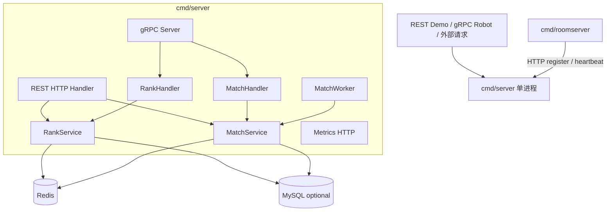
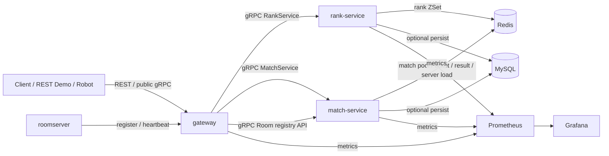
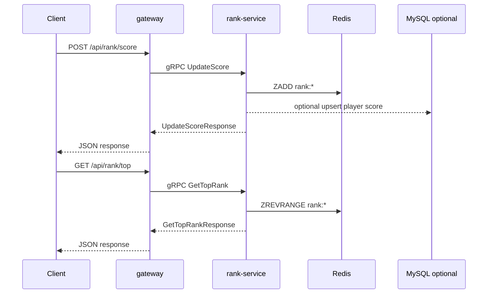
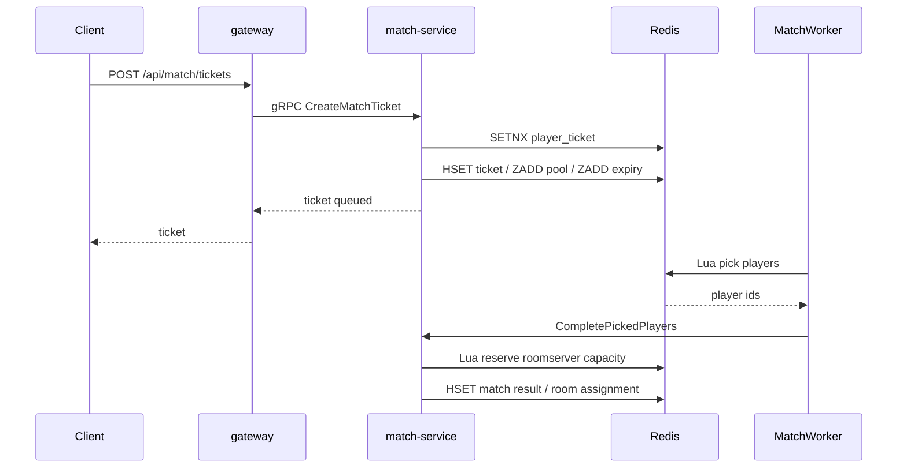
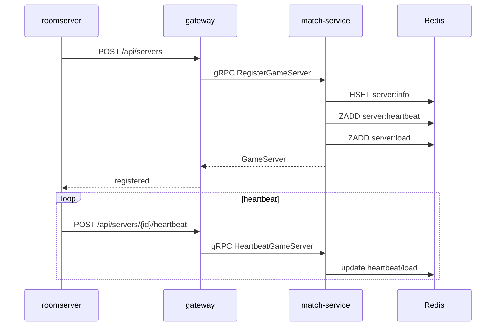
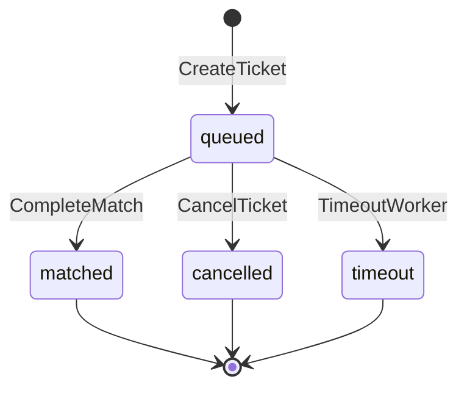
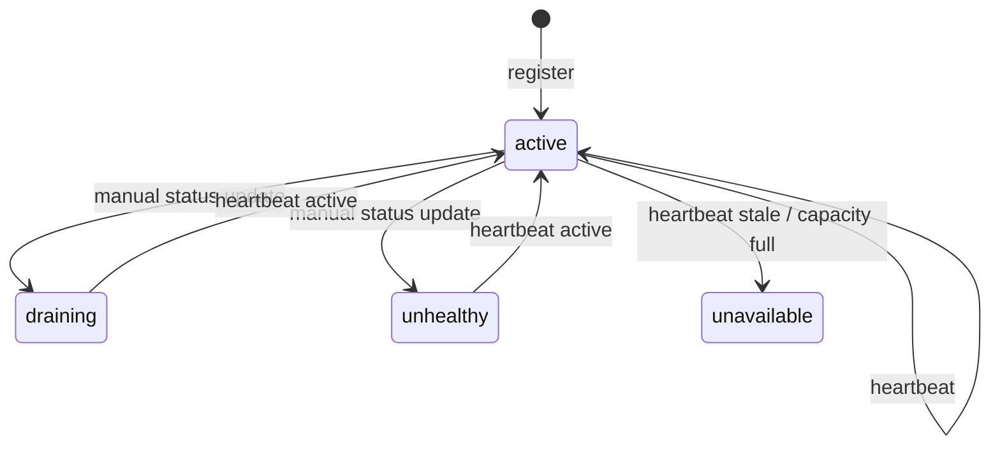

# CoreRank 最小分布式项目设计文档（历史设计基线）

> 本文是实施前设计稿，不是当前运行契约。当前事实以根目录 README、`docs/architecture.md` 和 `docs/api.md` 为准。

## 1. 设计结论

推荐目标形态：

```text
gateway
match-service
rank-service
roomserver
Redis
MySQL
Prometheus
Grafana
```

其中：

- `gateway` 是对外接入层。
- `match-service` 是匹配票据、匹配 worker、房间服注册和房间分配服务。
- `rank-service` 是排行榜服务。
- `roomserver` 继续作为独立房间服示例。
- Redis 是跨进程共享状态中心。
- MySQL 是可选持久化。

## 2. 当前架构



当前问题：

- 服务边界在代码里，不在进程和网络层面。
- REST handler 直接持有本地 service。
- match 和 rank 虽然有 gRPC handler，但都运行在同一个进程。
- 单个 `cmd/server/main.go` 同时承担太多启动职责。

## 3. 目标架构



## 4. 服务职责

### 4.1 gateway

职责：

- 对外提供 REST API。
- 统一接入客户端、demo、roomserver 的 HTTP 请求。
- 参数校验、错误码转换、日志记录。
- 初始化 rank-service 和 match-service 的 gRPC client。
- 暴露 gateway metrics。

不负责：

- 不直接操作 Redis。
- 不直接创建 ticket。
- 不直接更新排行榜。
- 不运行 MatchWorker。

建议目录：

```text
cmd/gateway/main.go
internal/gateway/http_handler.go
internal/gateway/clients.go
internal/gateway/config.go
```

### 4.2 rank-service

职责：

- 独立启动 gRPC RankService。
- 复用当前 `RankService` 业务逻辑。
- 操作 Redis ZSet 排行榜。
- 可选写入 MySQL 玩家分数和 rank snapshot。
- 暴露 rank-service metrics。

不负责：

- 不处理匹配票据。
- 不处理 roomserver。
- 不运行 MatchWorker。

建议目录：

```text
cmd/rank-service/main.go
internal/rank/handler.go
internal/rank/config.go
```

最小改造中，`internal/service/rank_service.go` 可以先保留原位置，避免大规模移动。后续确认稳定后再考虑迁移为 `internal/rank/service.go`。

### 4.3 match-service

职责：

- 独立启动 gRPC MatchService。
- 创建、查询、取消 match ticket。
- 查询 match result。
- 启动 MatchWorker。
- 处理 ticket timeout。
- 管理 roomserver 注册、心跳、列表和房间分配。
- 使用 Redis Lua 做原子取人和原子预留 roomserver 容量。
- 可选写入 MySQL ticket 和 match result。
- 暴露 match-service metrics。

不负责：

- 不对外提供 REST。
- 不处理排行榜。
- 不处理真实战斗逻辑。

建议目录：

```text
cmd/match-service/main.go
internal/match/handler.go
internal/match/config.go
```

最小改造中，`internal/service/match_service.go`、`matcher.go`、`room_allocator.go` 可先保留原位置。

### 4.4 roomserver

职责：

- 保持独立 TCP 房间服示例。
- 启动时注册自身。
- 定时发送心跳。
- 上报当前负载。
- 接收玩家入房、准备、离开等 TCP JSON-line 消息。

改造点：

- 当前 roomserver 通过 HTTP 调用 CoreRank。
- 推荐先保持 HTTP 调用 gateway，gateway 再转发到 match-service。
- 这样改动较小，演示链路清楚。

后续可选：

- roomserver 直接通过 gRPC 调用 match-service。

## 5. gRPC 协议设计

当前 `api/proto/rank.proto` 同时包含 RankService 和 MatchService。

最小改造建议：

1. 第一轮不强制拆 proto 文件。
2. 在当前 proto 中补充 roomserver 注册和心跳相关 RPC。
3. 确认服务拆分稳定后，再按领域拆成 `rank.proto`、`match.proto`、`room.proto`。

原因：

- 当前生成代码已经可用。
- 大规模拆 proto 会增加生成代码和 import 调整风险。
- 本轮重点是进程拆分，不是协议重组。

建议新增 RPC：

```text
service MatchService {
  CreateMatchTicket
  GetMatchTicket
  CancelMatchTicket
  GetMatchResult
  RegisterGameServer
  HeartbeatGameServer
  ListGameServers
}
```

## 6. 核心调用链路

### 6.1 排行榜链路



### 6.2 匹配链路



### 6.3 房间服注册链路



## 7. Redis Key 设计

沿用当前 key，避免破坏已有测试和 demo。

| Key | 类型 | 所属服务 | 说明 |
|---|---|---|---|
| `{rank:global}` | ZSet | rank-service | 全局排行榜 |
| `{rank:<leaderboard_type>}` | ZSet | rank-service | 多维榜单 |
| `{match:ticket_pool}` | ZSet | match-service | 匹配票据玩家池 |
| `{match:ticket_expiry}` | ZSet | match-service | ticket 超时索引 |
| `match:ticket:{ticket_id}` | Hash | match-service | ticket 详情 |
| `match:player_ticket:{player_id}` | String | match-service | 玩家当前排队 ticket |
| `match:result:{match_id}` | Hash | match-service | 匹配结果 |
| `server:info:{server_id}` | Hash | match-service | roomserver 元数据 |
| `server:heartbeat` | ZSet | match-service | roomserver 心跳索引 |
| `server:load:{match_mode}` | ZSet | match-service | roomserver 负载索引 |
| `room:assignment:{match_id}` | Hash | match-service | 房间分配结果 |

## 8. 状态设计

### 8.1 MatchTicket



规则：

- `queued` 是唯一可变状态。
- `matched`、`cancelled`、`timeout` 是终态。
- 并发修改时以 Redis 状态为准。

### 8.2 GameServer



规则：

- 只有 `active` 且心跳未过期且容量足够的 server 可以被分配。
- 分配容量必须通过 Lua 原子预留。

## 9. 配置设计

### 9.1 gateway

```text
GATEWAY_HTTP_ADDR=:8081
GATEWAY_GRPC_ADDR=:8080
GATEWAY_METRICS_ADDR=:9091
RANK_SERVICE_ADDR=127.0.0.1:18081
MATCH_SERVICE_ADDR=127.0.0.1:18082
```

### 9.2 rank-service

```text
RANK_GRPC_ADDR=:18081
RANK_METRICS_ADDR=:19081
REDIS_ADDR=127.0.0.1:6379
CORERANK_MYSQL_DSN=
CORERANK_MYSQL_REQUIRED=false
```

### 9.3 match-service

```text
MATCH_GRPC_ADDR=:18082
MATCH_METRICS_ADDR=:19082
REDIS_ADDR=127.0.0.1:6379
CORERANK_MYSQL_DSN=
CORERANK_MYSQL_REQUIRED=false
MATCH_WORKER_ENABLED=true
```

### 9.4 roomserver

```text
ROOM_SERVER_ID=demo-room-1
ROOM_SERVER_ADDR=127.0.0.1:7001
ROOM_SERVER_PUBLIC_ADDR=127.0.0.1:7001
CORE_RANK_HTTP=http://127.0.0.1:8081
MATCH_MODE=default
CAPACITY=100
HEARTBEAT_INTERVAL=3s
```

## 10. 目录规划

最小改造优先新增入口和轻量适配层，暂不大规模移动业务文件。

```text
cmd/
  gateway/
    main.go
  rank-service/
    main.go
  match-service/
    main.go
  server/
    main.go              # 暂时保留，作为 legacy single-process 入口
  roomserver/
    main.go

internal/
  gateway/
    clients.go
    http_handler.go
    config.go
  handler/
    rank_handler.go      # 可继续复用
    match_handler.go     # 补 roomserver gRPC 方法
  service/
    rank_service.go      # 继续复用
    match_service.go     # 继续复用
    matcher.go           # 由 match-service 启动
    room_allocator.go    # 继续复用
  repository/
    player_repo.go
    match_repo.go
    room_server_repo.go
    lua_scripts.go
```

后续如需更清晰，再把 `internal/service` 拆成 `internal/rank` 和 `internal/match`。本次不优先做大规模搬迁。

## 11. 监控设计

三个服务分别暴露 metrics：

| 服务 | metrics 地址 |
|---|---|
| gateway | `:9091` |
| rank-service | `:19081` |
| match-service | `:19082` |

Prometheus scrape targets：

```yaml
- targets: ["gateway:9091"]
- targets: ["rank-service:19081"]
- targets: ["match-service:19082"]
```

指标复用当前 `internal/metrics`。如果全局 registry 出现重复注册问题，再调整为进程内独立注册或分服务 label。

## 12. 失败场景

| 场景 | 处理 |
|---|---|
| 玩家重复创建 ticket | Redis `SetNX match:player_ticket:{player_id}` 拒绝第二次排队 |
| 多个 worker 同时取人 | Redis Lua 原子查询并删除候选玩家 |
| 房间服未注册 | 匹配不生成假的 room，玩家重新放回匹配池 |
| 房间服心跳过期 | 分配时排除 stale server |
| 房间容量不足 | Lua 预留容量失败，尝试下一个 server |
| rank-service 不可用 | 排行接口失败，但匹配链路不应受影响 |
| match-service 不可用 | 匹配接口失败，但排行榜链路不应受影响 |
| gateway 不可用 | 本地最小版外部请求不可用，生产化再考虑多 gateway |

## 13. 项目说明边界

可以说明：

> 这个项目从单进程服务拆成 gateway、match-service、rank-service 和 roomserver 多进程形态，通过 gRPC 调用和 Redis 共享状态验证了本地最小分布式链路。

不要写成：

> 这个项目已经支持生产级高并发、大规模在线、完整分布式框架。
