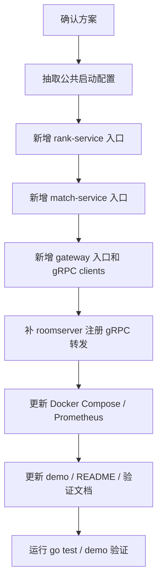

# CoreRank 最小分布式升级方案

## 1. 当前状态

已完成准备工作：

- CoreRank 已拉取到当前本地工作区的 `CoreRank` 仓库。
- 当前分支：`distributed-minimal`
- 当前 HEAD：`697fcdf2475f092bf031b8994eeca0d4157c1ef9`
- 远程仓库：`https://github.com/jingjie2002/CoreRank.git`

说明：

- GitHub HTTPS clone 在当前环境中出现过 TLS 握手失败。
- 已用本机已有仓库克隆到当前工作区，并把 `origin` 设置回 GitHub。
- 远程 HEAD 已通过 `git ls-remote` 确认为同一提交。

## 2. 推荐升级路线

推荐路线：先拆进程边界，再逐步整理目录。

不推荐一开始就大规模移动文件，因为当前项目已有测试、demo 和文档，先移动大量文件容易引入 import 和路径风险。



## 3. 施工步骤

### 步骤 1：抽取配置工具

新增：

```text
pkg/config/env.go
```

目标：

- 统一读取环境变量。
- 避免三个新入口重复写 `envOrDefault`、`envBool`。

预计改动：

- 新增 `pkg/config`。
- 后续新入口使用该包。

风险：

- 很低，不影响当前业务逻辑。

### 步骤 2：新增 rank-service

新增：

```text
cmd/rank-service/main.go
```

复用：

```text
internal/service/rank_service.go
internal/handler/rank_handler.go
internal/repository/player_repo.go
internal/repository/mysql_repo.go
pkg/redis/client.go
```

目标：

- 独立启动 gRPC RankService。
- 独立连接 Redis / MySQL。
- 独立暴露 metrics。

验证：

```powershell
go run ./cmd/rank-service
grpcurl -plaintext localhost:18081 list
go test ./...
```

### 步骤 3：新增 match-service

新增：

```text
cmd/match-service/main.go
```

复用：

```text
internal/service/match_service.go
internal/service/matcher.go
internal/service/room_allocator.go
internal/handler/match_handler.go
internal/repository/player_repo.go
internal/repository/match_repo.go
internal/repository/room_server_repo.go
```

目标：

- 独立启动 gRPC MatchService。
- 独立启动 MatchWorker。
- 保留 Redis Lua 原子匹配和 roomserver 容量预留。
- 独立暴露 metrics。

验证：

```powershell
go run ./cmd/match-service
grpcurl -plaintext localhost:18082 list
go test ./...
```

### 步骤 4：补 roomserver gRPC 能力

当前 REST API 里已有：

```text
POST /api/servers
GET /api/servers
POST /api/servers/{server_id}/heartbeat
```

需要在 gRPC MatchService 增加对应方法：

```text
RegisterGameServer
HeartbeatGameServer
ListGameServers
```

影响：

- 修改 `api/proto/rank.proto`。
- 重新生成 `*.pb.go` 和 `*_grpc.pb.go`。
- 扩展 `internal/handler/match_handler.go`。

风险：

- 这是接口契约变更，需要确认后再做。
- 如果本机没有 protoc 工具链，需要确认生成方式。

### 步骤 5：新增 gateway

新增：

```text
cmd/gateway/main.go
internal/gateway/clients.go
internal/gateway/http_handler.go
internal/gateway/config.go
```

目标：

- 对外保持现有 REST API 习惯。
- HTTP 请求进入 gateway。
- gateway 通过 gRPC 调用 rank-service / match-service。
- gateway 不直接操作 Redis。

改造方式：

- 以当前 `internal/handler/http_handler.go` 为模板。
- 把本地 service 调用替换为 gRPC client 调用。
- 错误码继续转换为 HTTP JSON。

验证：

```powershell
go run ./cmd/rank-service
go run ./cmd/match-service
go run ./cmd/gateway
python scripts\rest_demo.py
```

### 步骤 6：调整 roomserver 调用路径

推荐先保持：

```text
roomserver -> gateway HTTP -> match-service gRPC
```

原因：

- 改动小。
- 与现有 `roomserver` 代码兼容。
- REST demo 和 room TCP demo 更容易继续跑。

后续可选改成：

```text
roomserver -> match-service gRPC
```

这个可以作为后续增强，不放进第一轮代码改造。

### 步骤 7：更新 Docker Compose

新增服务：

```text
gateway
rank-service
match-service
```

保留：

```text
corerank-redis
corerank-mysql
prometheus
grafana
```

目标：

```powershell
docker compose up -d
```

后可以看到：

- gateway HTTP `8081`
- rank-service gRPC `18081`
- match-service gRPC `18082`
- Prometheus `9090`
- Grafana `3000`

当前已验证命令：

```powershell
powershell -NoProfile -ExecutionPolicy Bypass -File scripts\stability_preflight.ps1 -CheckEndpoints
docker compose build corerank-rank-service corerank-match-service corerank-gateway corerank-roomserver
docker compose up -d corerank-redis corerank-rank-service corerank-match-service corerank-gateway corerank-roomserver prometheus grafana
powershell -ExecutionPolicy Bypass -File scripts\distributed_smoke.ps1
powershell -NoProfile -ExecutionPolicy Bypass -File scripts\distributed_soak.ps1 -DurationMinutes 10 -IntervalSeconds 30
```

当前已验证结果：

- `corerank-gateway`、`corerank-rank-service`、`corerank-match-service` 均可运行。
- gateway HTTP smoke 可以完成房间服注册、匹配、结果查询、结算、排行榜 top 和玩家单查。
- Prometheus 的三个 targets 均为 `up`。
- Grafana 能加载 `CoreRank Overview` dashboard。

`roomserver` 容器化和自动注册/心跳已纳入当前 Compose 范围，`scripts/distributed_smoke.ps1` 会等待 `compose-room-1` 注册，验证重复 ticket / 取消 ticket 冲突路径，并验证匹配结果中的 `ServerID` / `ServerAddr` 以及 TCP `join -> ready -> room_started -> leave` 流程。

### 步骤 8：更新文档和 demo

需要更新：

```text
README.md
docs/architecture.md
docs/api.md
docs/demo-guide.md
docs/verification.md
prometheus.yml
```

注意：

- 不删除旧单进程说明，先标记为 legacy 或兼容启动方式。
- 新增分布式启动说明。

## 4. 预计影响范围

会改：

- `cmd/`
- `internal/gateway/`
- `internal/handler/`
- `api/proto/`
- `pkg/config/`
- `docker-compose.yml`
- `prometheus.yml`
- `docs/`
- `README.md`

尽量不改：

- `internal/repository/` 的核心 Redis / MySQL 行为。
- `internal/service/` 的核心业务算法。
- `cmd/roomserver` 的 TCP 房间逻辑。
- 现有测试，除非接口变化必须同步。

## 5. 风险与处理

| 风险 | 说明 | 处理 |
|---|---|---|
| proto 变更需要重新生成代码 | 可能缺 protoc | 先检查工具链；缺失时只改文档或请求确认安装 |
| gateway 远程调用错误转换不一致 | HTTP 状态码可能变 | 保持现有错误码映射，补测试 |
| metrics 全局注册冲突 | 多进程通常不冲突，但测试可能重复注册 | 如出现再做 registry 调整 |
| Docker Compose 构建变复杂 | Go 服务需要镜像构建 | 可先用本机 `go run` 验证，再补 compose build |
| roomserver 注册链路改变 | demo 可能失败 | 第一轮保持 roomserver 走 gateway HTTP |
| 本机运行不稳定 | Docker、长时间运行或资源不足可能导致电脑卡死 | 先运行 `scripts/stability_preflight.ps1`，确认内存、磁盘、端口和服务状态，再逐步启动 |

## 6. 验证计划

### 6.1 文档确认阶段

当前阶段只验证：

```powershell
git status --short
git branch --show-current
```

不声称代码已完成。

### 6.2 代码改造阶段

每完成一个服务入口，运行：

```powershell
go test ./...
go vet ./...
```

### 6.3 本地链路阶段

依次启动：

```powershell
docker compose build corerank-rank-service corerank-match-service corerank-gateway corerank-roomserver
docker compose up -d corerank-redis corerank-rank-service corerank-match-service corerank-gateway corerank-roomserver prometheus grafana
```

再执行：

```powershell
powershell -ExecutionPolicy Bypass -File scripts\distributed_smoke.ps1
```

### 6.4 最终验收链路

必须证明：

1. 两个玩家创建 ticket 后可以匹配成功。
2. 匹配结果带 `match_id`、`room_id`、`server_id` 或 `server_addr`。
3. 结算后排行榜更新。
4. 查询 TopN 能看到排行榜结果。
5. 重复 ticket、取消 ticket、roomserver 不可用等失败场景有明确结果。

## 7. 需要你确认的决策点

### 决策 1：是否保留旧 `cmd/server`

推荐：保留。

理由：

- 可作为单进程回退入口。
- 方便对比改造前后。
- 避免一开始删除导致 demo 断掉。

### 决策 2：proto 是否第一轮拆文件

推荐：不拆。

理由：

- 当前 `rank.proto` 已经包含 RankService 和 MatchService。
- 第一轮先补 roomserver RPC 即可。
- 等链路跑通后再整理 proto 文件更稳。

### 决策 3：roomserver 第一轮走 HTTP 还是 gRPC

推荐：第一轮继续走 gateway HTTP。

理由：

- 当前 roomserver 已经这样工作。
- 改动少，demo 更容易保留。
- 分布式核心仍然成立，因为 gateway 会转发到 match-service。

### 决策 4：是否大规模移动 `internal/service`

推荐：第一轮不移动。

理由：

- 先证明多进程链路。
- 移动目录容易制造 import 噪音。
- 文档里说明服务归属即可，后续再整理目录。

## 8. 推荐确认口径

如果你认可这个方案，可以确认：

```text
确认按 docs/distributed-minimal 的方案进入代码改造：
保留旧 cmd/server；
第一轮不拆 proto 文件；
roomserver 继续走 gateway HTTP；
不大规模移动 internal/service；
先完成 gateway / rank-service / match-service 多进程链路。
```

收到确认后，再进入代码改造阶段。
